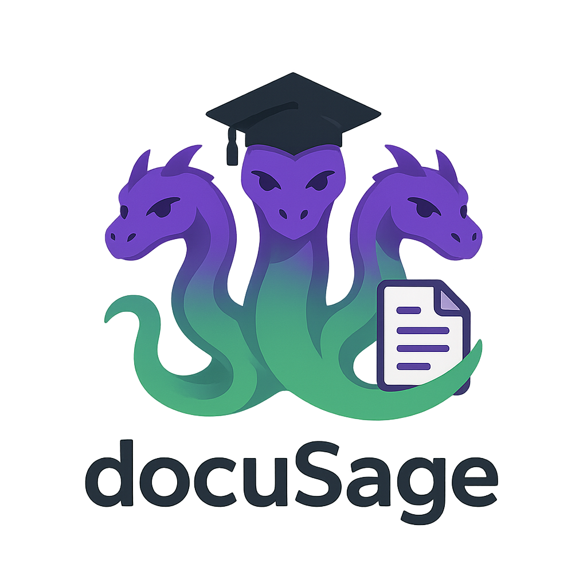

<p align="center">
  
</p>

<h1 align="center">HydraNote</h1>

<p align="center">
  <strong>AI-powered document indexing and interaction system</strong>
</p>

<p align="center">
  Organize projects, ingest documents, chat with your files using multiple AI providers, and create rich Markdown notes — all from a single workspace.
</p>

<p align="center">
  <a href="#features">Features</a> &middot;
  <a href="#tech-stack">Tech Stack</a> &middot;
  <a href="#getting-started">Getting Started</a> &middot;
  <a href="#docker-development">Docker</a> &middot;
  <a href="#architecture">Architecture</a> &middot;
  <a href="#community">Community</a> &middot;
  <a href="#contributing">Contributing</a>
</p>

---

<p align="center">
  
</p>

---

## Features

- **Multi-Provider AI Chat** — Connect to OpenAI, Anthropic (Claude), Google (Gemini), Ollama, or run models locally via Hugging Face GGUF
- **Semantic Search** — Vector embeddings index your documents for meaning-based retrieval across entire projects
- **Document Ingestion** — Import PDF, DOCX, TXT, Markdown, and images (with OCR via Tesseract.js)
- **Markdown Editor** — Full editor with edit, split, and preview modes, Mermaid diagram support, and syntax highlighting
- **AI Tool Execution** — The LLM can read, search, summarize, write, update files, and perform web research on your behalf
- **File System Sync** — Bidirectional sync with local directories using the File System Access API
- **Project Organization** — Group files into projects with hierarchical folder structures and drag-and-drop
- **Version History** — Track file changes with diff-based version storage
- **Export** — Generate and download PDF, DOCX, or Markdown from any document
- **Local Models (Desktop)** — Run GGUF models offline with GPU acceleration on macOS (Metal), Windows/Linux (CUDA, Vulkan)
- **MCP Server (Desktop)** — Expose your workspace to external LLM tools like Claude Desktop
- **Web Research** — AI-powered web search with caching and semantic indexing of results

---

## Tech Stack

| Layer | Technology |
|-------|------------|
| **Frontend** | [Ionic](https://ionicframework.com/) + [Vue 3](https://vuejs.org/) + TypeScript |
| **Database** | [DuckDB](https://duckdb.org/) (in-browser WASM with OPFS persistence) |
| **Editor** | [TipTap](https://tiptap.dev/) (ProseMirror) + [marked](https://marked.js.org/) + [highlight.js](https://highlightjs.org/) |
| **AI Providers** | OpenAI, Anthropic, Google Gemini, Ollama, Hugging Face Local |
| **Embeddings** | OpenAI, Gemini, Ollama, Hugging Face Local (independent from LLM) |
| **Document Processing** | PDF.js, Mammoth (DOCX), Tesseract.js (OCR) |
| **Diagrams** | [Mermaid](https://mermaid.js.org/) |
| **Desktop** | [Electron](https://www.electronjs.org/) via [Capacitor](https://capacitorjs.com/) |
| **Build** | [Vite](https://vitejs.dev/) |
| **Testing** | [Vitest](https://vitest.dev/) (unit) + [Cypress](https://www.cypress.io/) (E2E) |

---

## Getting Started

### Prerequisites

- **Node.js** >= 18
- **npm** >= 9
- An API key from at least one AI provider (OpenAI, Anthropic, Google), **or** a local [Ollama](https://ollama.com/) installation

### Installation

```bash
# Clone the repository
git clone https://github.com/gustavowt/hydranote.git
cd hydraNote

# Install dependencies
npm install

# Start the development server
npm run dev
```

The app will be available at `http://localhost:5173`. On first launch, a setup wizard will guide you through configuring your AI provider.

Copy optional environment defaults if needed:

```bash
cp .env.example .env
```

### Docker Development

```bash
docker compose up --build
```

Then open `http://localhost:5173`.

### Available Scripts

| Command | Description |
|---------|-------------|
| `npm run dev` | Start the Vite dev server |
| `npm run build` | Type-check and build for production |
| `npm run preview` | Preview the production build |
| `npm run test:unit` | Run unit tests with Vitest |
| `npm run test:e2e` | Run E2E tests with Cypress |
| `npm run lint` | Lint the codebase with ESLint |

### Building for Desktop (Electron)

```bash
# Build the web app and sync with Electron
npm run build && npx cap sync @capacitor-community/electron

# Run in development
cd electron && npm start

# Package for macOS
cd electron && npm run electron:make -- --mac

# Package for Windows
cd electron && npm run electron:make -- --win
```

> **Note:** Cross-platform builds are best done via CI. See `.github/workflows/build-windows.yml` for reference.

---

## Architecture

### Workspace Layout

```
+------------------+----------------------------+--------------------+
|  Logo            |       [ Search Bar ]       |  New Note | Settings|
+------------------+----------------------------+--------------------+
|   Projects       |                            |                    |
|     Tree         |      Markdown Editor       |    Chat Sidebar    |
|   Sidebar        |    (edit/split/preview)    |                    |
|   (280px)        |          (flex)            |      (360px)       |
|                  |                            |                    |
|   Collapsible    |                            |     Collapsible    |
+------------------+----------------------------+--------------------+
```

### Core Data Flow

```
User Input --> Router --> Tool Selection --> Tool Execution --> LLM Response --> UI
                 |
                 v
            Embeddings --> Vector Search --> Context Retrieval
```

### Tool Execution (Planner-Executor-Checker)

1. **Planner** — Analyzes user intent and creates an ordered tool execution plan
2. **Executor** — Runs each tool with context passing between steps
3. **Checker** — Verifies completion, replans if needed, generates a concise interpretation

### Available AI Tools

| Tool | Description |
|------|-------------|
| `read` | Read file content from a project |
| `search` | Semantic search across project files |
| `summarize` | Summarize documents (hierarchical for large files) |
| `write` | Create new files (AI-formatted Markdown, PDF, DOCX) |
| `updateFile` | Update existing files using chain-of-thought diff analysis |
| `webResearch` | Search the web and index results |
| `createProject` | Create a new project |
| `moveFile` | Move or rename files within/between projects |
| `deleteFile` | Delete a file |
| `deleteProject` | Delete a project |

---

## Supported AI Providers

### LLM Providers

| Provider | Example Models |
|----------|---------------|
| **OpenAI** | GPT-4.1, GPT-5 Mini, o4-mini |
| **Anthropic** | Claude Sonnet 4.5, Claude Haiku 4.5 |
| **Google** | Gemini 2.5 Pro, Gemini 2.5 Flash |
| **Ollama** | Llama, Mistral, Qwen, and any local model |
| **Hugging Face Local** | GGUF models via node-llama-cpp (Electron only) |

### Embedding Providers

| Provider | Models |
|----------|--------|
| **OpenAI** | text-embedding-3-small, text-embedding-3-large |
| **Gemini** | text-embedding-004 |
| **Ollama** | nomic-embed-text, mxbai-embed-large, all-minilm |
| **Hugging Face Local** | Xenova/all-MiniLM-L6-v2 (offline, Electron only) |

> LLM and embedding providers are configured independently — mix and match as needed.

---

## Project Structure

```
src/
├── components/
│   ├── ChatSidebar.vue              # AI chat with project context
│   ├── FileReferenceAutocomplete.vue # @file: autocomplete in chat
│   ├── FileTreeNode.vue             # Recursive file tree node
│   ├── FileTreeSidebar.vue          # File tree sidebar panel
│   ├── MarkdownEditor.vue           # Markdown editor (edit/split/preview)
│   ├── PDFViewer.vue                # PDF viewer (Electron)
│   ├── ProjectsTreeSidebar.vue      # Projects/files tree navigator
│   ├── RichTextEditor.vue           # WYSIWYG editor for DOCX (TipTap)
│   ├── SearchAutocomplete.vue       # Global fuzzy search
│   └── settings/                    # Reusable settings components
│
├── icons/                           # SVG icon components for AI providers
│
├── services/
│   ├── chatService.ts               # Chat session management
│   ├── database.ts                  # DuckDB operations & schema
│   ├── documentProcessor.ts         # File ingestion (extract, chunk, embed)
│   ├── embeddingService.ts          # Multi-provider embeddings
│   ├── fileSystemService.ts         # File System Access API
│   ├── llmService.ts                # LLM API calls (all providers)
│   ├── localModelService.ts         # Hugging Face local GGUF models
│   ├── mcpService.ts                # MCP server for external tools
│   ├── noteService.ts               # AI-powered note formatting
│   ├── projectService.ts            # Project/file CRUD (single source of truth)
│   ├── syncService.ts               # Bidirectional file system sync
│   ├── toolService.ts               # Planner-Executor-Checker orchestration
│   ├── versionService.ts            # File version history (diff-based)
│   ├── webSearchService.ts          # Web research with caching
│   └── ...
│
├── types/
│   └── index.ts                     # TypeScript type definitions
│
└── views/
    ├── SetupWizardPage.vue          # First-run setup wizard
    ├── WorkspacePage.vue            # Main workspace (3-panel layout)
    └── SettingsPage.vue             # Settings page
```

For detailed technical documentation, see [`docs/DEVELOPER.md`](docs/DEVELOPER.md).

---

## Configuration

HydraNote stores settings in `localStorage`. Key configuration areas:

| Setting | Description |
|---------|-------------|
| **LLM Provider** | Choose your AI provider and model, configure API keys |
| **Embedding Provider** | Independent from LLM — pick the best embedder for your use case |
| **File System Sync** | Enable bidirectional sync with a local directory |
| **Web Search** | Configure SearXNG, Brave Search, or DuckDuckGo for web research |
| **Note Formatting** | Custom instructions for AI-powered note formatting |

All settings are accessible from the Settings page or during the initial setup wizard.

---

## Contributing

Contributions are welcome! Here's how to get started:

See full contributor documentation in [`CONTRIBUTING.md`](CONTRIBUTING.md).

### Development Workflow

1. **Fork** the repository and clone your fork
2. **Create a branch** for your feature or fix:
   ```bash
   git checkout -b feat/your-feature-name
   ```
3. **Install dependencies** and start the dev server:
   ```bash
   npm install && npm run dev
   ```
4. **Make your changes** following the existing code patterns
5. **Test** your changes:
   ```bash
   npm run lint
   npm run test:unit
   ```
6. **Commit** with a clear message and **open a Pull Request**

### Code Style

- **TypeScript** throughout — avoid `any` types where possible
- **Vue 3 Composition API** with `<script setup lang="ts">`
- **Ionic components** for UI — follow existing component patterns
- **Services** are singleton modules — keep business logic out of components
- **`projectService`** is the single source of truth for all file/project operations

### Adding a New AI Tool

1. Add the tool name to the `ToolName` type in `src/types/index.ts`
2. Add parameter and result types in `src/types/index.ts`
3. Add router keywords in `ROUTER_PROMPT` in `toolService.ts`
4. Implement the `executeYourTool()` function in `toolService.ts`
5. Add the case in the `executeTool()` switch statement
6. Update the system prompt in `chatService.ts`
7. Export from `src/services/index.ts`
8. Update `docs/DEVELOPER.md`

### Reporting Issues

- Use [GitHub Issues](../../issues) to report bugs or request features
- Include steps to reproduce, expected behavior, and screenshots when possible

---

## Community

### Starter Issues

Looking for a place to start? See [`.github/GOOD_FIRST_ISSUES.md`](.github/GOOD_FIRST_ISSUES.md) for beginner-friendly tasks you can pick up quickly.

### Collaboration Templates

- Bug reports: [`.github/ISSUE_TEMPLATE/bug_report.md`](.github/ISSUE_TEMPLATE/bug_report.md)
- Feature requests: [`.github/ISSUE_TEMPLATE/feature_request.md`](.github/ISSUE_TEMPLATE/feature_request.md)
- Pull requests: [`.github/PULL_REQUEST_TEMPLATE.md`](.github/PULL_REQUEST_TEMPLATE.md)
- Conduct guidelines: [`CODE_OF_CONDUCT.md`](CODE_OF_CONDUCT.md)

### Repository Visibility Tips

- Add GitHub topics: `vue`, `ionic`, `typescript`, `ai`, `llm`, `duckdb`, `electron`, `markdown-editor`, `semantic-search`, `rag`
- Add a social preview image in GitHub repository settings
- Post a short demo video or GIF in the repository page and README

---

## Browser Support

| Feature | Chrome/Edge/Opera | Firefox/Safari |
|---------|-------------------|----------------|
| Core app | Yes | Yes |
| File System Sync | Yes (File System Access API) | Not supported |
| Local Models | Electron only | Electron only |
| MCP Server | Electron only | Electron only |

---

## License

This project is open source. See the [LICENSE](LICENSE) file for details.

---

<p align="center">
  Built with Vue, Ionic, and a lot of AI
</p>
