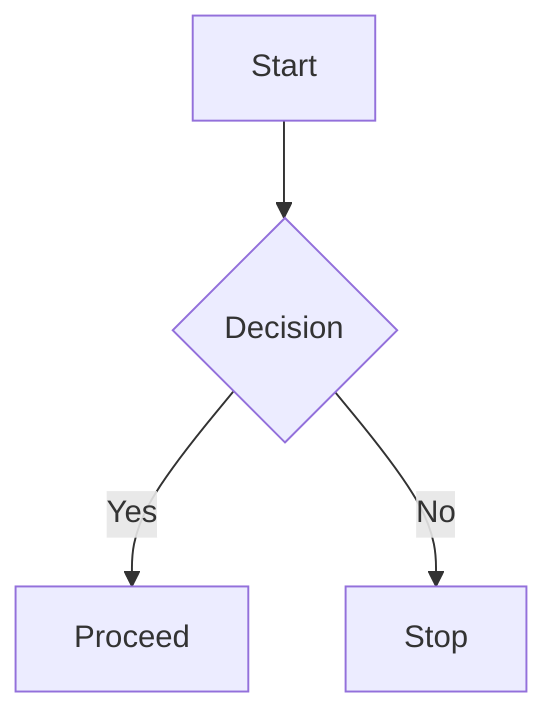

# HydraNote Developer Documentation

This document provides technical documentation for developers working on HydraNote. It covers the main services, tools, and architectural decisions implemented through Phases 1-12 of the roadmap.

## Table of Contents

1. [Architecture Overview](#architecture-overview)
2. [Services](#services)
3. [Tools](#tools)
4. [Workspace Components](#workspace-components)
5. [File Management](#file-management)
6. [File System Sync](#file-system-sync)
7. [Telemetry & Metrics](#telemetry--metrics)
8. [Phase 12 Guardrails](#phase-12-guardrails)
9. [File Version History](#file-version-history)
10. [Setup Wizard](#setup-wizard)
11. [Routing](#routing)
12. [Configuration](#configuration)
13. [MCP Server](#mcp-server)
14. [File Structure](#file-structure)
15. [Local Models (Hugging Face)](#local-models-hugging-face)

---

## Architecture Overview

HydraNote is an AI-powered document indexing and interaction system built with:

- **Frontend**: Ionic Vue (Vue 3 + TypeScript)
- **Database**: DuckDB (in-browser, WASM with OPFS persistence)
- **AI**: OpenAI API / Anthropic (Claude) / Google (Gemini) / Ollama (local LLMs)
- **Document Processing**: PDF.js, Mammoth (DOCX), Tesseract.js (OCR)
- **Markdown**: marked + highlight.js + Mermaid (diagrams)
- **Rich Text Editor**: Tiptap (ProseMirror-based) for DOCX editing
- **File System Sync**: File System Access API (bidirectional sync with local directories)

### Workspace Layout

The app uses a unified three-panel workspace layout:

```
┌─────────────────────────────────────────────────────────────────┐
│  Logo  │        [  Search Bar  ]          │  New Note │ Settings│
├──────────────┬─────────────────────────────┬────────────────────┤
│   Projects   │                             │                    │
│     Tree     │      Markdown Editor        │    Chat Sidebar    │
│   Sidebar    │    (edit/split/preview)     │                    │
│  (280px)     │         (flex)              │      (360px)       │
│              │                             │                    │
│  Collapsible │                             │     Collapsible    │
└──────────────┴─────────────────────────────┴────────────────────┘
```

- **Header Search Bar**: Global fuzzy search across all projects (files and content)
- **ProjectsTreeSidebar**: Hierarchical view of projects and files
- **MarkdownEditor**: Full editor with edit/split/preview modes, inline note saving
- **ChatSidebar**: Project-scoped chat with AI, @file references

### Core Data Flow

```
User Input → Router → Tool Selection → Tool Execution → LLM Response → UI
                ↓
            Embeddings → Vector Search → Context Retrieval
```

### Application Bootstrap

The application initializes critical resources before mounting the Vue app. This ensures all services have access to required dependencies (database, etc.) from the start.

```typescript
// main.ts
async function bootstrap() {
  // Initialize database and core services BEFORE mounting
  await initialize();  // from projectService

  const app = createApp(App)
    .use(IonicVue)
    .use(router);

  await router.isReady();
  app.mount('#app');
}
```

**Important:** All services that need database access should use `projectService` functions which internally call `ensureInitialized()`. This pattern guarantees the database is ready before any operations.

---

## Services

### Project Service (`projectService.ts`)

Manages projects and document ingestion. This is the **single source of truth** for all file operations.

**Initialization:** All public functions call `ensureInitialized()` internally, which lazily initializes the database if needed. The `initialize()` function is also called at app boot in `main.ts` for immediate availability.

#### Key Functions

| Function | Description |
|----------|-------------|
| `createProject(name, description?)` | Create a new project (+ sync to FS). **Idempotent**: returns existing project if name matches (case-insensitive) |
| `getProject(projectId)` | Get project by ID |
| `getAllProjects()` | List all projects |
| `deleteProject(projectId)` | Delete project and all files (+ sync to FS) |
| `ingestDocument(file, projectId)` | Process and index a document |
| `get_project_files(projectId)` | Get all files in a project |
| `get_file_chunks(fileId)` | Get chunks for a file |
| `searchProject(projectId, query, k)` | Semantic search within a project |
| `getProjectFileTree(projectId)` | Get hierarchical file tree (Phase 11) |
| `findFileByPath(projectId, path)` | Find file by path (for @file: references) |

#### Centralized File Operations (Single Source of Truth)

These functions handle both database AND file system sync automatically:

| Function | Description |
|----------|-------------|
| `createFile(projectId, path, content, type)` | Create file (DB + FS sync) |
| `updateFile(fileId, content)` | Update file content (DB + FS sync) |
| `renameFile(fileId, newName)` | Rename file within same project (DB + FS sync) |
| `deleteFile(fileId)` | Delete file (DB + FS sync) |
| `moveFile(fileId, targetProjectId, targetDir?)` | Move file (DB + FS sync) |
| `indexFileForSearch(projectId, fileId, content, type)` | Create chunks and embeddings |
| `createEmptyMarkdownFile(projectId, fileName, dir?)` | Create empty file (DB + FS sync) |

### Note Service (`noteService.ts`)

Provides AI-powered note formatting and organization functions. These functions are used internally by the `write` tool when creating Markdown files.

#### Key Functions

| Function | Description |
|----------|-------------|
| `formatNote(rawText, metadata?)` | Transform raw text to structured Markdown (used by write tool for MD files) |
| `generateNoteTitle(content)` | Generate a title from note content (used when title not provided) |
| `titleToSlug(title)` | Convert title to URL-safe filename |
| `decideNoteDirectory(projectId, title, metadata?)` | AI-decide best directory (used when path not provided) |
| `decideNoteDirectoryWithDirs(projectId, title, dirs, metadata?)` | AI-decide directory (with pre-fetched dirs for parallel execution) |
| `getProjectDirectories(projectId)` | Get existing directories for a project |
| `generateUniqueFileName(projectId, slug, dir)` | Generate unique filename avoiding collisions |
| `globalAddNote(params, onProgress?)` | Dashboard flow with project routing (standalone pipeline) |
| `decideTargetProject(content, tags?)` | AI-decide which project for a note |

#### Write Tool Pipeline for Markdown Files

**Original Sequential Flow:**
```
Raw Text → Format Note → Generate Title → Decide Directory → Persist → Index
           (LLM #1)       (LLM #2)         (LLM #3)
```

**Optimized Parallel Flow (Phase 13):**
```
                    ┌─── Format Note (LLM) ───┐
Raw Text ──────────►├─── Generate Title (LLM) ├───► Decide Directory (LLM) → Persist → Index
                    └─── Pre-fetch Dirs (DB) ─┘
                         (PARALLEL)                    (SEQUENTIAL)
```

This reduces total time by running 2 LLM calls + 1 DB call in parallel instead of 3 sequential LLM calls.

#### Global AddNote Pipeline (Phase 10 + Phase 13 Optimization)

**Original Sequential Flow:**
```
Raw Text → Decide Project* → Format Note → Generate Title → Decide Directory → Persist → Index
              (LLM #1)        (LLM #2)       (LLM #3)         (LLM #4)
```

**Optimized Parallel Flow (Phase 13):**
```
                                          ┌─── Format Note (LLM) ───┐
Raw Text → Decide Project* ──────────────►├─── Generate Title (LLM) ├───► Decide Directory → Persist → Index
              (LLM #1)                    └─── Pre-fetch Dirs (DB) ─┘         (LLM #2)
                ↓                              (PARALLEL)
        (* May require user confirmation - Phase 12)
```

This reduces from 4 sequential LLM calls to 2 sequential phases (1 LLM + 2 parallel LLM calls + 1 LLM).

### Export Service (`exportService.ts`)

Handles file export operations for downloading content in different formats (PDF, DOCX, Markdown).

#### Key Functions

| Function | Description |
|----------|-------------|
| `exportToFile(title, content, format, options?)` | Export content and trigger download |
| `exportToPDF(title, content, options?)` | Convenience wrapper for PDF export |
| `exportToDOCX(title, content, options?)` | Convenience wrapper for DOCX export |
| `exportToMarkdown(title, content, options?)` | Convenience wrapper for Markdown export |
| `generateExportBlob(title, content, format)` | Generate document blob without downloading |
| `getFileNameWithoutExtension(filePath)` | Extract base name from file path |
| `getExtensionForFormat(format)` | Get file extension for a format |
| `getMimeTypeForFormat(format)` | Get MIME type for a format |

#### Types

```typescript
interface ExportResult {
  success: boolean;
  fileName: string;
  error?: string;
}

interface ExportOptions {
  customFileName?: string;  // Override default file name
  autoDownload?: boolean;   // Trigger download (default: true)
}
```

#### Usage Example

```typescript
import { exportToFile } from '@/services';

// Export current content as PDF
const result = await exportToFile('My Document', markdownContent, 'pdf');

if (result.success) {
  console.log(`Downloaded: ${result.fileName}`);
} else {
  console.error(`Export failed: ${result.error}`);
}
```

#### Integration with MarkdownEditor

The export service is used by the MarkdownEditor's 3-dots menu to provide "Export as PDF/DOCX/Markdown" options. The component calls `exportToFile()` and displays toast feedback based on the result.

### Tool Service (`toolService.ts`)

Handles tool execution with a Planner → Executor → Checker architecture.

#### Available Tools

| Tool | Purpose | Keywords |
|------|---------|----------|
| `read` | Read file content | read, open, show, view |
| `search` | Semantic search | search, find, buscar, encontrar |
| `summarize` | Summarize documents | summarize, summary, tl;dr |
| `write` | Create files (AI pipeline for all formats) | write, create, generate, add note, save note |
| `updateFile` | Update sections in existing files | update, edit, modify, replace, insert |
| `webResearch` | Search the web for information | web search, google, look up online, current news |
| `createProject` | Create a new project (global mode) | create project, new project |
| `moveFile` | Rename, move within project, or move between projects | rename, move file, transfer |
| `deleteFile` | Delete a file | delete file, remove file |
| `deleteProject` | Delete a project (global mode) | delete project, remove project |

#### Orchestration Flow (Planner → Executor → Checker)

The chat system uses a three-phase execution pattern with smart auto-execution for simple queries:

```
User Message
    |
    v
┌─────────────────────────────────────────┐
│         PHASE 1: PLANNER                │
│                                         │
│  - Analyze user request                 │
│  - Determine if clarification needed    │
│  - Create ordered tool execution plan   │
│  - Identify dependencies between steps  │
└─────────────────────────────────────────┘
    |
    v
┌─────────────────────────────────────────┐
│      AUTO-EXECUTE CHECK                 │
│                                         │
│  If single-step AND read-only tool:     │
│  → Execute immediately (no confirmation)│
│  Else:                                  │
│  → Show Plan UI for user confirmation   │
└─────────────────────────────────────────┘
    |
    v (Auto-execute OR User clicks "Execute")
┌─────────────────────────────────────────┐
│         PHASE 2: EXECUTOR               │
│                                         │
│  For each step in plan:                 │
│  1. Check dependencies (wait if needed) │
│  2. Enrich params with context          │
│  3. Execute tool (with log updates)     │
│  4. Extract context for next steps      │
│  5. Pass context chain forward          │
└─────────────────────────────────────────┘
    |
    v
┌─────────────────────────────────────────┐
│         PHASE 3: CHECKER                │
│                                         │
│  - Compare original request vs results  │
│  - Verify all tasks completed           │
│  - If incomplete: replan and re-execute │
│  - If complete: generate interpretation │
└─────────────────────────────────────────┘
    |
    v
┌─────────────────────────────────────────┐
│      FINAL RESPONSE                     │
│                                         │
│  - Collapsible tool execution log       │
│  - Formatted tool outputs               │
│  - LLM interpretation of results        │
└─────────────────────────────────────────┘
```

**Key Features:**
- **Auto-execution for simple queries**: Single-step read-only operations (read, search, summarize) execute immediately without confirmation
- **Collapsible tool log**: Shows real-time execution progress, auto-collapses when complete
- **Dual-format response**: Both raw tool outputs AND LLM interpretation for better UX
- User sees and confirms complex multi-step plans before tools run
- Context passes between steps (e.g., web research → file creation)
- Automatic re-planning if tasks are incomplete
- Dependencies between steps are respected

#### Auto-Execute Tools

The following tools auto-execute without confirmation when used alone:

| Tool | Description |
|------|-------------|
| `read` | Read file content |
| `search` | Semantic search |
| `summarize` | Summarize documents |

This improves UX for common read-only queries like "What does file X say about Y?" by removing the confirmation step.

#### Inline Tool Indicators

Tool executions are displayed as **inline indicators** within the chat flow (Cursor-inspired UI):

```
[User Message]
───────────────────────
    🔍 Searched "config" in project    2.3s
    📄 Read settings.ts                 1.1s  
───────────────────────
[Assistant Response]
```

**Features:**
- Compact single-line display with icon, description, and duration
- Click to expand and see result preview
- Persisted with assistant messages in chat history
- Nested children for multi-step tools (e.g., web research)

**Web Research Nested Display:**
```
🌐 Web Research: "Vue best practices"       12.3s
   ├─ vuejs.org/guide                       ✓
   ├─ dev.to/vue-tips                       ✓
   ├─ medium.com/vue-2024                   ✓
   └─ Processing results                    ✓
```

| Field | Description |
|-------|-------------|
| Tool icon | Visual identifier for each tool |
| Description | Human-readable step description |
| Status | Running (spinner), Completed (checkmark), Failed (X) |
| Duration | Execution time in ms/s |
| Result preview | Click to expand (collapsed by default) |
| Children | Nested progress for multi-step tools |
| Error | Error message if tool failed |

#### Key Functions

| Function | Description |
|----------|-------------|
| `createExecutionPlan()` | Phase 1: Create plan from user message |
| `shouldAutoExecutePlan()` | Check if plan should auto-execute (single-step read-only) |
| `executePlan()` | Phase 2: Execute plan with context passing |
| `checkCompletion()` | Phase 3: Validate all tasks complete |
| `runPlannerFlow()` | Full orchestration with re-planning, tool logs, and LLM interpretation |
| `executeTool()` | Execute a single tool call |
| `getToolIcon()` | Get icon for a tool (used in UI) |

#### Types

```typescript
interface ExecutionPlan {
  id: string;
  summary: string;           // Human-readable plan description
  steps: PlanStep[];         // Ordered sequence of tools
  needsClarification: boolean;
  clarificationQuestion?: string;
}

interface PlanStep {
  id: string;
  tool: ToolName;
  params: Record<string, string>;
  description: string;       // "Search the web for Vue 3 best practices"
  dependsOn?: string[];      // IDs of steps that must complete first
  contextNeeded?: string[];  // Context keys needed from previous steps
  providesContext?: string[];// Context keys this step provides
}

interface ExecutionResult {
  planId: string;
  completedSteps: CompletedStep[];
  failedSteps: FailedStep[];
  accumulatedContext: Record<string, unknown>;
  finalResponse: string;
}

// Tool Log Entry (for UI display)
interface ToolLogEntry {
  id: string;
  tool: ToolName;
  description: string;
  status: 'running' | 'completed' | 'failed';
  resultPreview?: string;    // Brief preview (first 200 chars)
  resultData?: string;       // Full result (expandable)
  error?: string;
  startTime: Date;
  endTime?: Date;
  durationMs?: number;
  children?: ToolExecutionChild[];  // For nested tools like webResearch
}

// Child execution step for nested tools
interface ToolExecutionChild {
  id: string;
  label: string;      // e.g., "vuejs.org/guide" or "Processing results"
  status: 'pending' | 'running' | 'completed' | 'failed';
  timestamp: Date;
}

// Tool execution record for persistence in chat history
interface ToolExecutionRecord {
  id: string;
  tool: ToolName;
  description: string;
  status: ToolLogStatus;
  durationMs?: number;
  resultPreview?: string;
  resultData?: string;
  error?: string;
  timestamp: Date;
  children?: ToolExecutionChild[];
}

// Enhanced Planner Flow Result
interface PlannerFlowResult {
  state: PlannerFlowState;
  response: string;              // LLM interpretation
  toolResults: ToolResult[];     // Raw tool results
  toolLogs: ToolLogEntry[];      // For UI display
  formattedToolOutputs: string[];// Formatted tool outputs
  success: boolean;
}
```

#### Context Chain Example

```
Step 1: webResearch("Vue 3 composition API")
  → Result: {chunks: [...], sources: [...]}
  → Context: {webResearchResults: "...summary..."}

Step 2: createProject("Vue Learning")
  → Uses: (none)
  → Context: {projectId: "abc123", projectName: "Vue Learning"}

Step 3: write({title: "notes", content: "..."})
  → Uses: webResearchResults (Step 1), projectId (Step 2)
  → Generates content from web research context
```

#### Upsert Behavior (createProject)

The `createProject` tool uses **upsert semantics** - if a project with the same name already exists (case-insensitive), it returns success with the existing project instead of failing. This ensures:
- Pipelines can continue even if the project already exists
- The `projectId` context is always extracted for subsequent steps
- No manual intervention needed for idempotent operations

#### Failure Handling

The executor stops execution immediately when:
1. A step fails that provides context needed by subsequent steps
2. A step has explicit dependencies (`dependsOn`) that failed
3. An exception occurs during step execution

When execution stops, the user receives a clear error message explaining:
- Which step failed and why
- Which steps were skipped as a result
- Which steps completed successfully before the failure

### Chat Service (`chatService.ts`)

Manages chat sessions, context windows, and **persistent chat history**.

#### Key Functions

| Function | Description |
|----------|-------------|
| `buildSystemPrompt(projectId)` | Build system prompt with project context |
| `manageContext(projectId, messages, query)` | Manage context window size |
| `createChatSession(projectId, title?)` | Create new chat session (persisted to DB) |
| `getSessionHistory(projectId?)` | Get all chat sessions for a project/global |
| `switchToSession(sessionId)` | Load and switch to a specific session |
| `startNewSession(projectId?)` | Start a fresh chat session |
| `addMessage(sessionId, role, content)` | Add message (persisted to DB) |
| `prepareChatRequest(sessionId, message)` | Prepare API request with context |

#### Chat History Persistence

Chat sessions and messages are persisted to DuckDB with automatic retention:

- **Maximum 20 sessions per project** (or global) - older sessions are pruned on new session creation
- **Session titles** are auto-generated from the first user message
- **Messages are saved** immediately to the database
- **Session switching** allows users to browse and resume past conversations

Database tables:
- `chat_sessions`: Stores session metadata (id, project_id, title, timestamps)
- `chat_messages`: Stores individual messages (id, session_id, role, content, timestamp)

### Telemetry Service (`telemetryService.ts`) - Phase 12

Tracks events and metrics for monitoring AI behavior.

#### Event Types

| Event | Description |
|-------|-------------|
| `note_created` | Note successfully created |
| `project_created` | Project created (auto or user) |
| `directory_created` | AI created new directory |
| `note_creation_failed` | Note creation failed |

#### Key Functions

```typescript
// Track events
trackNoteCreated({ source, projectId, autoSelected, filePath })
trackProjectCreated({ projectId, automatic, reason })
trackDirectoryCreated({ projectId, directoryPath, triggeringNoteTitle, reasoning })

// Query metrics
getMetrics()           // Returns aggregated TelemetryMetrics
getMetricsSummary()    // Returns human-readable summary
getAllEvents()         // Returns all tracked events
```

---

## Tools

### WriteFile Tool (Phase 6 + 8)

Generates documents in multiple formats.

#### Parameters

```typescript
interface WriteToolParams {
  format: 'pdf' | 'docx' | 'md';
  title: string;
  content: string;
  useContext?: boolean;
  fileType?: 'pdf' | 'docx' | 'markdown';
}
```

#### Markdown Support (Phase 8)

- Extension: `.md`
- MIME type: `text/markdown`
- Encoding: UTF-8
- Heading-aware chunking for indexing

### Write Tool - Markdown AI Pipeline

When the `write` tool is used with `format: "md"`, it automatically applies the AI pipeline:

1. **Content Formatting**: Always formats content via `formatNote()` LLM
2. **Title Generation**: Generates title via `generateNoteTitle()` if not provided
3. **Directory Decision**: Decides directory via `decideNoteDirectory()` if not provided

For PDF/DOCX formats:
- Title is generated if not provided (via `generateNoteTitle()`)
- Directory is decided if not provided (via `decideNoteDirectory()`)
- Content is generated if empty
- Content is NOT formatted (only MD files are formatted)

#### Internal Types (used by noteService)

```typescript
interface AddNoteParams {
  projectId: string;
  rawNoteText: string;
  contextMetadata?: {
    tags?: string[];
    topic?: string;
    source?: string;
    language?: string;
  };
}
```

### UpdateFile Tool

Updates or modifies existing Markdown or DOCX files using a simplified approach.

#### Architecture

The tool uses two strategies based on file size:

```
┌─────────────────────────────────────────────────────────────┐
│                    UpdateFile Called                         │
└─────────────────────────────────────────────────────────────┘
                              │
                              ▼
                    ┌─────────────────┐
                    │  File Size?     │
                    └─────────────────┘
                     /              \
                    /                \
            < 50KB                  > 50KB
               │                       │
               ▼                       ▼
   ┌─────────────────────┐   ┌─────────────────────┐
   │ Full File Rewrite   │   │ 3-Level Cascade     │
   │ via LLM             │   │ (deterministic)     │
   └─────────────────────┘   └─────────────────────┘
               │                       │
               ▼                       ▼
         LLM applies              1. Keywords
         edit directly            2. Line numbers
                                  3. Exact match
```

#### Small Files (<50KB): Full Rewrite

For most notes and documents, the entire file is sent to the LLM with the edit instruction. The LLM returns the complete modified file.

**Benefits:**
- Simpler, more reliable
- LLM has full context
- No section identification needed
- Handles complex multi-section edits

#### Large Files (>50KB): 3-Level Cascade

For large files, uses deterministic matching only:

| Level | Method | Example |
|-------|--------|---------|
| 1 | Special Keywords | `end`, `start`, `append`, `prepend` |
| 2 | Line Numbers | `line:42`, `lines:10-25` |
| 3 | Exact Match | Direct text lookup via `indexOf` |

If no match is found, the tool fails with a helpful error asking for more specific input.

**Special Keywords:**
- End/append: `end`, `bottom`, `eof`, `fim`, `final`, `append`
- Start/prepend: `start`, `beginning`, `top`, `prepend`

#### Parameters

```typescript
interface UpdateFileToolParams {
  fileId?: string;
  fileName?: string;
  operation: 'replace' | 'insert_before' | 'insert_after';
  sectionIdentifier: string;
  newContent?: string;  // Required for large files, optional for small files
}
```

#### Preview Flow

The tool uses a preview/confirmation flow:

1. `executeUpdateFileTool` applies the edit (full rewrite or section-based)
2. Preview includes diff visualization (added/removed lines)
3. User confirms or cancels the update
4. On confirm, `applyFileUpdate` commits changes and re-indexes the file

#### Supported File Types

- Markdown (`.md`)
- DOCX (`.docx`)

### WebResearch Tool

Searches the web for current information not available in project documents.

#### Architecture

```
User Query → Check Cache → Web Search API → Fetch Pages → Extract Text
                ↓                                              ↓
         If cache hit                                   Chunk Content
                ↓                                              ↓
         Use cached                                   Generate Embeddings
                ↓                                              ↓
         Vector Search ←────────────────────────── Store in Cache
                ↓
         Return Relevant Chunks
```

#### Supported Providers

| Provider | Configuration | Notes |
|----------|--------------|-------|
| SearXNG | Instance URL | Self-hosted, private, recommended |
| Brave Search | API Key | Free tier: 2000 queries/month |
| DuckDuckGo | None | Instant Answers API, limited results |

#### Parameters

```typescript
interface WebResearchToolParams {
  query: string;           // Search query (required)
  maxResults?: number;     // Max URLs to fetch (default: 5)
  maxChunks?: number;      // Max chunks to return (default: 10)
}
```

#### Safety Limits & Progress Reporting

The web research tool includes safeguards to prevent runaway operations:

| Limit | Value | Purpose |
|-------|-------|---------|
| Global timeout | 30 seconds | Prevents indefinite hangs |
| Page fetch timeout | 5 seconds | Skips slow pages |
| Max chunks per page | 5 | Limits embedding generation |
| Max content length | 50K chars | Truncates huge pages |
| Concurrent fetches | 3 | Parallel page downloads |
| Concurrent embeddings | 5 | Parallel embedding generation |

Progress is reported in real-time to the UI via callback, updating the step detail with:
- "Checking cache..."
- "Searching the web..."
- "Fetching pages 1-3 of 5..."
- "Processing page 1/3: Title..."
- "Analyzing content (2/5)..."
- "Finding relevant content..."

#### Caching

- Results are cached in DuckDB (`web_search_cache` and `web_search_chunks` tables)
- Default cache duration: 60 minutes
- Cache is keyed by query hash
- Expired entries are automatically cleaned up

#### CORS Handling

- **Electron/Capacitor**: Direct fetch, no CORS issues
- **Browser**: Requires CORS proxy configuration in settings

---

## Workspace Components

### WorkspacePage (`WorkspacePage.vue`)

Main layout orchestrating the three-panel workspace.

#### State Management

| State | Description |
|-------|-------------|
| `selectedProjectId` | Currently active project |
| `selectedFileId` | Currently open file |
| `currentFile` | File object with content |
| `currentProject` | Project object |

#### Child Component Communication

```typescript
// ProjectsTreeSidebar events
@select-project="handleProjectSelect"
@select-file="handleFileSelect"
@create-project="showCreateProjectModal = true"
@delete-project="handleDeleteProject"
@file-created="handleFileCreatedFromSidebar"
@file-moved="handleFileMoved"

// MarkdownEditor events
@save="handleSaveExistingFile"
@content-change="handleContentChange"
@note-saved="handleNoteSaved"

// ChatSidebar events
@project-change="handleChatProjectChange"
```

### MarkdownEditor (`MarkdownEditor.vue`)

Full-featured markdown editor with three view modes.

#### Props

| Prop | Type | Description |
|------|------|-------------|
| `currentFile` | `ProjectFile \| null` | File being edited |
| `currentProject` | `Project \| null` | Current project context |
| `initialContent` | `string` | Initial editor content |

#### View Modes

- **edit**: Raw markdown textarea
- **split**: Side-by-side editor and preview
- **view**: Rendered markdown preview

#### Mermaid Diagram Support

The markdown editor supports Mermaid flowcharts and diagrams. Users can create diagrams using fenced code blocks with the `mermaid` language identifier:

````markdown

````

**Supported Diagram Types:**
- Flowcharts (`flowchart`, `graph`)
- Sequence diagrams (`sequenceDiagram`)
- Class diagrams (`classDiagram`)
- State diagrams (`stateDiagram-v2`)
- Entity relationship diagrams (`erDiagram`)
- Gantt charts (`gantt`)
- Pie charts (`pie`)
- And more (see [Mermaid documentation](https://mermaid.js.org/))

**Implementation Notes:**
- Mermaid is initialized with `theme: 'dark'` to match the editor aesthetic
- Diagrams are rendered asynchronously after DOM updates (debounced 300ms)
- Invalid syntax shows an error message instead of breaking the preview
- Mermaid code is base64-encoded in data attributes to preserve special characters

**Syntax Tips:**
- When node labels contain special characters like `()`, `{}`, `[]`, or quotes, wrap in double quotes:
  - ✅ `A["Label with (parentheses)"]`
  - ❌ `A[Label with (parentheses)]`
- The note formatter prompt automatically applies these rules when generating mermaid diagrams

#### Exposed Methods

```typescript
setContent(content: string)   // Set editor content
clearContent()                // Clear editor
focusEditor()                 // Focus textarea
```

#### Events

| Event | Payload | Description |
|-------|---------|-------------|
| `save` | `(content: string, file?: ProjectFile)` | Emitted when saving existing file |
| `content-change` | `(content: string)` | Emitted on editor content change |
| `note-saved` | `(result: GlobalAddNoteResult)` | Emitted after new note saved |
| `rename` | `(fileId: string, newName: string)` | Emitted when file is renamed |
| `selection-to-chat` | `(selection: SelectionContext)` | Emitted when user sends selected text to chat |

#### Send to Chat Feature

Users can select text in the editor and send it as context to the chat sidebar. The selection includes file context and line numbers, enabling the LLM to edit the specific section when requested.

**SelectionContext Interface:**
```typescript
interface SelectionContext {
  text: string;           // Selected text content
  filePath: string | null; // File path (null if unsaved)
  fileId: string | null;   // File ID for database reference
  startLine: number;       // Start line number (1-indexed)
  endLine: number;         // End line number (1-indexed)
}
```

**How It Works:**

1. **Selection Detection**: Works in all view modes (edit, split, view)
   - In edit/split mode: Detects textarea selection via `selectionStart`/`selectionEnd`
   - In view/split mode: Detects preview selection via `window.getSelection()`
   - Line numbers are calculated from character offsets

2. **Floating Button**: A "Send to Chat" button appears near the selection
   - Positioned dynamically based on selection location
   - Auto-hides after 4 seconds or when selection is cleared
   - Uses `Teleport` to render at body level for proper z-indexing

3. **Chat Integration**: Selection is formatted like a code editor reference:
   ```
   @selection:filepath.md:10-25
   ```
   followed by the selected text in a code block

4. **Edit Behavior**: The LLM understands that when a selection reference is provided with edit commands (rephrase, rewrite, fix, etc.), it should use `updateFile` to modify the existing file, NOT create a new file.

```
User selects text → Floating button appears → Click "Send to Chat"
       ↓
MarkdownEditor emits 'selection-to-chat' with SelectionContext
       ↓
WorkspacePage calls chatSidebarRef.insertSelection(context)
       ↓
ChatSidebar inserts @selection:file:lines reference in input
       ↓
User types "rephrase this" → LLM uses updateFile on that section
```

#### Actions Menu

The editor header includes a 3-dots menu (visible when editing an existing file) with the following actions:

| Action | Description |
|--------|-------------|
| **Run AI Formatting** | Opens a modal for manually triggering AI formatting with optional custom instructions |
| **Rename** | Enables inline editing of the file name in the header |
| **Version History** | Opens modal showing file version history with restore options |
| **Export as PDF** | Downloads current content as a formatted PDF file |
| **Export as DOCX** | Downloads current content as a Word document |
| **Export as Markdown** | Downloads current content as a Markdown file with metadata |

**AI Formatting:**
- Uses `formatNote()` from noteService
- Combines user's additional instructions with settings-based formatting instructions
- Replaces editor content with formatted result
- Does not auto-save (allows user to review changes first)

**Rename:**
- Transforms the file title into an editable input field
- Save button confirms the rename, Escape cancels
- Emits `rename` event to parent for processing via `renameFile()` service
- Sidebar is refreshed after successful rename

**Export:**
- Uses `generatePDF()`, `generateDOCX()`, `generateMarkdown()` from documentGeneratorService
- PDF: Renders markdown as formatted text with proper headings and lists
- DOCX: Creates Word document with proper formatting (bold, italic, headings)
- Markdown: Wraps content with title and generation date metadata
- Uses file-saver library for downloads
- Toast notification confirms successful export

### ChatSidebar (`ChatSidebar.vue`)

Collapsible AI chat panel with project context.

#### Props

| Prop | Type | Description |
|------|------|-------------|
| `initialProjectId` | `string?` | Initial project to select |

#### Features

- Project selector dropdown
- @file: autocomplete for file references
- @selection: references from editor text selection
- Markdown rendering in responses
- Quick action buttons for common queries

#### Exposed Methods

```typescript
selectProject(projectId: string)      // Switch to project
selectGlobalMode()                    // Switch to global mode (all projects)
insertSelection(text: string)         // Insert @selection: reference from editor
```

#### Reference Types

| Reference | Format | Description |
|-----------|--------|-------------|
| `@file:` | `@file:path/to/file.md` | References a file in the project |
| `@project:` | `@project:ProjectName` | References a specific project |
| `@selection:` | `@selection:file.md:10-25` + code block | User-selected text with file context and line range |

**Selection Reference Behavior:**
- When user selects text and sends to chat, it's formatted as `@selection:filepath:startLine-endLine`
- The selected text is included in a code block after the reference
- The LLM interprets edit commands (rephrase, fix, modify) on selections as `updateFile` operations
- This ensures editing selected content modifies the existing file rather than creating new files

### ProjectsTreeSidebar (`ProjectsTreeSidebar.vue`)

Collapsible hierarchical project/file navigator.

#### Props

| Prop | Type | Description |
|------|------|-------------|
| `selectedProjectId` | `string?` | Currently selected project |
| `selectedFileId` | `string?` | Currently selected file |

#### Exposed Methods

```typescript
refresh()                              // Reload projects and file trees
revealFile(projectId, fileId)          // Expand parents and scroll file into view
```

#### Drag and Drop

Files can be dragged and dropped between projects or into directories:

| Action | Result |
|--------|--------|
| Drag file to project header | Move file to project root |
| Drag file to directory | Move file into that directory |

**Events emitted:**

| Event | Payload | Description |
|-------|---------|-------------|
| `file-moved` | `(sourceProjectId, targetProjectId, file)` | File moved between projects |

**Implementation notes:**
- Source project ID is stored when drag starts for reliable cross-project moves
- Both database and file system are updated via `moveFile()` in projectService
- Target project is auto-expanded after move
- File is revealed (scrolled into view) in its new location

#### File Reveal Feature

When a file is created or saved, the sidebar automatically:
1. Expands the project containing the file
2. Expands all parent directories to reveal the file
3. Scrolls the file into view
4. Highlights the file with a brief animation

This is triggered automatically when `selectedFileId` prop changes, or can be called manually via `revealFile()`.

### SearchAutocomplete (`SearchAutocomplete.vue`)

Global search bar with fuzzy autocomplete across all projects.

#### Features

- **Fuzzy search**: JavaScript-based fuzzy matching (exact, prefix, contains, character sequence)
- **Multi-target search**: Searches project names, file names, and file paths
- **Lazy loading**: Data loaded on first focus, cached for subsequent searches
- **Keyboard navigation**: Arrow keys, Enter to select, Escape to close
- **Visual feedback**: Loading spinner, match highlighting, project/file sections

#### Events

| Event | Payload | Description |
|-------|---------|-------------|
| `select-file` | `FileItem` | Emitted when user selects a file |
| `select-project` | `Project` | Emitted when user selects a project |

#### Search Algorithm

The fuzzy scoring function uses a multi-tier approach:

```typescript
// Scoring priority:
1.0  - Exact match
0.9  - Starts with query
0.7  - Contains query
0.6  - All query characters found in sequence (fuzzy match)
```

#### Data Loading

Uses existing `getAllFilesForAutocomplete()` and `getAllProjects()` functions to load data on first focus. This reuses the same pattern as `FileReferenceAutocomplete.vue` for consistency.

---

## File Management

### Centralized File Operations (Single Source of Truth)

All file creation and modification operations are centralized in `projectService.ts` to ensure consistent database persistence AND file system synchronization.

```
┌─────────────────────────────────────────────────────────────┐
│                    Consumer Services                         │
│  (toolService, noteService, chatService, components)        │
└─────────────────────────────────────────────────────────────┘
                              │
                              ▼
┌─────────────────────────────────────────────────────────────┐
│                   projectService.ts                          │
│  ┌─────────────────────────────────────────────────────────┐│
│  │  Centralized File Operations                            ││
│  │  • createFile(projectId, path, content, type)           ││
│  │  • updateFile(fileId, content)                          ││
│  │  • deleteFile(fileId)                                   ││
│  │  • moveFile(fileId, targetProject, targetPath)          ││
│  │  • indexFileForSearch(projectId, fileId, content, type) ││
│  └─────────────────────────────────────────────────────────┘│
│                    │                    │                    │
│                    ▼                    ▼                    │
│              ┌──────────┐        ┌─────────────┐            │
│              │ database │        │ syncService │            │
│              └──────────┘        └─────────────┘            │
└─────────────────────────────────────────────────────────────┘
```

#### Key Functions

| Function | Description |
|----------|-------------|
| `createFile(projectId, path, content, type)` | Create file in DB + sync to FS |
| `updateFile(fileId, content)` | Update content in DB + sync to FS |
| `deleteFile(fileId)` | Delete from DB + sync to FS |
| `moveFile(fileId, targetProjectId, targetDir?)` | Move file + sync to FS |
| `indexFileForSearch(projectId, fileId, content, type)` | Create chunks + embeddings |

#### Usage Pattern

All services that create or modify files should use these centralized functions:

```typescript
// ✅ Correct: Use centralized functions
import { createFile, indexFileForSearch } from './projectService';

const file = await createFile(projectId, 'notes/my-note.md', content, 'md');
await indexFileForSearch(projectId, file.id, content, 'md');

// ❌ Wrong: Direct database calls (bypasses file system sync)
await conn.query(`INSERT INTO files ...`);
```

### File Tree API (Phase 11)

```typescript
interface FileTreeNode {
  id: string;
  name: string;
  path: string;
  type: 'file' | 'directory';
  fileType?: SupportedFileType;
  children?: FileTreeNode[];
  expanded?: boolean;
}
```

### @file: Reference Syntax (Phase 11)

Users can reference files in chat/editor using:

```
@file:path/to/file.md
@file:document-name.pdf
```

The router detects these references and automatically uses the `read` tool.

---

## File System Sync

HydraNote supports bidirectional file system synchronization, allowing projects and files to be mirrored to actual directories on disk.

### Overview

When enabled, the sync system:
- Creates a directory for each project in the configured root folder
- Writes markdown files to the corresponding project directories
- Detects changes made externally (outside HydraNote) and imports them
- Supports automatic sync on save and manual sync

### File System Structure

```
[Root Path]/
├── Project-A/
│   ├── notes/
│   │   └── meeting-notes.md
│   └── research/
│       └── api-design.md
└── Project-B/
    └── notes/
        └── quick-note.md
```

### Services

#### File System Service (`fileSystemService.ts`)

Handles low-level file system operations. Supports both:
- **Browser**: File System Access API (Chrome, Edge, Opera)
- **Electron**: Native file system via IPC handlers

All functions automatically detect the runtime environment and use the appropriate API.

| Function | Description |
|----------|-------------|
| `selectRootDirectory()` | Prompt user to select root sync directory |
| `createProjectDirectory(projectName)` | Create project directory in root folder |
| `ensureFileSystemPermission()` | Ensure FS permission early (call during user gesture) |
| `writeFile(projectName, filePath, content)` | Write file to disk |
| `readFile(projectName, filePath)` | Read file from disk |
| `deleteFile(projectName, filePath)` | Delete file from disk |
| `listProjectFiles(projectName)` | List all files in project directory |
| `listRootDirectories()` | List all project directories in root |
| `isSyncAvailable()` | Check if sync is enabled and configured |
| `isFileSystemAccessSupported()` | Check if FS sync is supported (browser API or Electron) |
| `isElectron()` | Check if running in Electron environment |

#### Sync Service (`syncService.ts`)

Handles bidirectional synchronization logic.

**Important:** Sync service uses `projectService` functions for all database operations, ensuring proper initialization and consistent behavior. Never call database functions directly from syncService.

| Function | Description |
|----------|-------------|
| `syncAll()` | Full sync of all projects (both directions) |
| `syncProject(projectId)` | Sync a single project |
| `syncFileToFileSystem(projectName, filePath, content)` | Sync single file to disk |
| `syncFileFromFileSystem(projectId, projectName, filePath)` | Import file from disk |
| `startFileWatcher()` | Start polling for external changes |
| `stopFileWatcher()` | Stop the file watcher |

### Automatic Sync Triggers

All file operations automatically sync to the file system when sync is enabled. This is handled by the centralized functions in `projectService.ts`:

| Action | Function | Sync Behavior |
|--------|----------|---------------|
| Create project | `createProject()` | Creates project directory |
| Delete project | `deleteProject()` | Deletes project directory |
| Create file | `createFile()` | Writes file to disk |
| Save/edit file | `updateFile()` | Updates file on disk |
| Delete file | `deleteFile()` | Deletes file from disk |
| Move file | `moveFile()` | Moves file on disk |
| AI creates file | `createFile()` (via tools) | Writes file to disk |
| AI updates file | `updateFile()` (via tools) | Updates file on disk |

**Important:** All services (toolService, noteService, etc.) must use the centralized functions from `projectService.ts` to ensure consistent sync behavior.

### Import from File System

When "Sync Now" is clicked:
1. Existing projects sync bidirectionally
2. New directories in root folder become new projects
3. New `.md` files are imported into the database
4. Modified external files update the database

### Configuration

Settings stored in `localStorage` under `hydranote_filesystem_settings`:

```typescript
interface FileSystemSettings {
  enabled: boolean;           // Whether sync is enabled
  rootPath: string;           // Display path of root directory
  syncOnSave: boolean;        // Auto-sync when files are saved
  watchForChanges: boolean;   // Poll for external changes
  watchInterval: number;      // Polling interval (ms)
  lastSyncTime?: string;      // ISO timestamp of last sync
}
```

### Browser Compatibility

The File System Access API is supported in:
- Chrome (recommended)
- Edge
- Opera

Not supported in:
- Firefox
- Safari

For unsupported browsers, a warning message is displayed in Settings.

### User Gesture Requirement

The File System Access API requires a **user gesture** (click, keypress) to request permissions. This means:
- Permission must be obtained during a click/keypress event handler
- After multiple `await` calls, the user gesture may be "consumed" by the browser

To handle this, the `ensureFileSystemPermission()` function should be called early in any user-initiated flow that may need file system access. For example, `ChatSidebar.vue` calls this at the start of `sendMessage()` before any other async operations.

### Settings UI

The Storage section in Settings (`SettingsPage.vue`) provides:
- Enable/disable sync toggle
- Directory picker button
- Sync on save toggle
- Watch for external changes toggle
- Manual "Sync Now" button
- Disconnect button
- Last sync time display

---

## Telemetry & Metrics

### Phase 12 Metrics Tracked

| Metric | Description |
|--------|-------------|
| `notesCreated` | Total notes created |
| `notesFromDashboard` | Notes created via dashboard |
| `notesFromProjectChat` | Notes created via project chat |
| `projectsAutoCreated` | Projects created by AI |
| `projectsUserCreated` | Projects created by user |
| `directoriesCreated` | Directories created by AI |

### Audit Logging

Directory and automatic project creation are logged to console:

```
[AUDIT] New directory created by AI: { project, directory, note, reasoning, timestamp }
[AUDIT] Project auto-created by AI: { type, timestamp, projectId, automatic, reason }
```

---

## Phase 12 Guardrails

### Directory Creation Guardrails

The `decideNoteDirectory` prompt includes strict rules:

1. **Default to existing directories** - Always prefer existing directories
2. **Avoid creating new directories** unless:
   - No existing directory can contain the note
   - The note represents a completely new domain
   - Multiple future notes would use this directory
3. **Naming rules**: lowercase, hyphen-separated, max 1 level deep
4. **When in doubt**: Use "notes" directory

### Project Creation Guardrails

The `decideTargetProject` prompt includes:

1. **Always use existing project** when topic loosely relates
2. **Never create new project** unless:
   - No projects exist
   - Note is completely unrelated domain
3. **Broad interpretation**: "Work" can contain any work-related notes
4. **Confirmation required**: New projects always require user confirmation

### User Confirmation Flow

When AI suggests creating a new project:

1. `globalAddNote` returns `pendingConfirmation` with proposal
2. UI shows confirmation modal
3. User can:
   - Confirm the new project
   - Choose an existing project
   - Cancel
4. Pipeline resumes with user's choice

---

## Types Reference

### Core Types

```typescript
type SupportedFileType = 'pdf' | 'txt' | 'docx' | 'md' | 'png' | 'jpg' | 'jpeg' | 'webp';
type ProjectStatus = 'created' | 'indexing' | 'indexed' | 'error';
type ToolName = 'read' | 'search' | 'summarize' | 'write' | 'updateFile' | 'createProject' | 'moveFile' | 'deleteFile' | 'deleteProject' | 'webResearch';
type DocumentFormat = 'pdf' | 'docx' | 'md';
type UpdateOperation = 'replace' | 'insert_before' | 'insert_after';
type SectionIdentificationMethod = 'header' | 'exact_match' | 'semantic';
type WebSearchProvider = 'searxng' | 'brave' | 'duckduckgo';
```

### File System Sync Types

```typescript
type FileSyncStatus = 'synced' | 'pending' | 'conflict' | 'error';
type SyncDirection = 'to_filesystem' | 'from_filesystem' | 'bidirectional';

interface FileSystemEntry {
  relativePath: string;
  name: string;
  isDirectory: boolean;
  size?: number;
  modifiedTime: Date;
  content?: string;
}

interface SyncResult {
  success: boolean;
  filesWritten: number;
  filesRead: number;
  filesDeleted: number;
  conflictsDetected: number;
  conflicts: SyncConflict[];
  error?: string;
  syncTime: Date;
}
```

### Telemetry Types

```typescript
type TelemetryEventType = 'note_created' | 'project_created' | 'directory_created' | 'note_creation_failed';
type NoteCreationSource = 'dashboard' | 'project_chat';
```

### Web Search Types

```typescript
type WebSearchProvider = 'searxng' | 'brave' | 'duckduckgo';

interface WebSearchSettings {
  provider: WebSearchProvider;
  searxngUrl?: string;        // SearXNG instance URL
  braveApiKey?: string;       // Brave Search API key
  cacheMaxAge: number;        // Cache duration in minutes
  maxResults: number;         // Max URLs to fetch per search
}

interface WebChunk {
  id: string;
  cacheId: string;
  url: string;
  title: string;
  text: string;
  chunkIndex: number;
  embedding: number[];
  score?: number;             // Similarity score after vector search
}

interface WebResearchResult {
  query: string;
  sources: Array<{ url: string; title: string }>;
  relevantContent: WebChunk[];
  fromCache: boolean;
  searchTime: number;
  error?: string;
}
```

---

## Setup Wizard

A first-run configuration wizard guides new users through essential setup when the application boots for the first time.

### Overview

The setup wizard:
- Appears automatically on first launch (before the main workspace)
- Uses a step-by-step flow with Previous/Next navigation
- Requires users to view all steps before completing
- Saves all settings to localStorage upon completion
- Marks completion state so it doesn't reappear on subsequent launches

### Wizard Steps

| Step | Title | Purpose |
|------|-------|---------|
| 1 | Welcome | Introduction to HydraNote features |
| 2 | Storage | Configure file system sync (optional) |
| 3 | AI Provider | Select and configure AI provider (OpenAI, Claude, Gemini, Ollama) |
| 4 | AI Instructions | Set note formatting preferences and default directory |

### Flow Diagram

```
┌─────────────────────────────────────────────────────────────────┐
│                      App Bootstrap                               │
└─────────────────────────────────────────────────────────────────┘
                              │
                              ▼
                    ┌─────────────────┐
                    │ shouldShowWizard │
                    │   (localStorage) │
                    └─────────────────┘
                     /              \
                    /                \
              false                  true
                 │                     │
                 ▼                     ▼
        ┌──────────────┐     ┌───────────────────┐
        │  Workspace   │     │   Setup Wizard    │
        │    Page      │     │   (4 steps)       │
        └──────────────┘     └───────────────────┘
                                     │
                                     ▼ (on complete)
                           markWizardCompleted()
                                     │
                                     ▼
                             Redirect to Workspace
```

### Setup Wizard Service (`setupWizardService.ts`)

Manages wizard completion state in localStorage.

| Function | Description |
|----------|-------------|
| `shouldShowWizard()` | Check if wizard should be shown (not completed) |
| `isWizardCompleted()` | Check if wizard has been completed |
| `markWizardCompleted()` | Mark wizard as completed (sets localStorage flag) |
| `resetWizardState()` | Reset wizard state for testing/debugging |

### localStorage Keys

| Key | Description |
|-----|-------------|
| `hydranote_wizard_completed` | `"true"` if wizard has been completed |

### Router Integration

The router uses a navigation guard to redirect to `/setup` on first boot:

```typescript
router.beforeEach((to, _from, next) => {
  const needsSetup = shouldShowWizard();
  
  if (to.meta.isSetupWizard) {
    next();
  } else if (needsSetup) {
    next('/setup');
  } else {
    next();
  }
});
```

---

## Routing

Routes include the setup wizard with conditional redirect:

```typescript
const routes = [
  { path: '/', redirect: '/workspace' },
  { path: '/setup', component: SetupWizardPage, meta: { isSetupWizard: true } },
  { path: '/workspace', component: WorkspacePage },
  { path: '/home', redirect: '/workspace' },
  { path: '/project/:id/chat', redirect: '/workspace' },
  { path: '/settings', component: SettingsPage },
];
```

The navigation guard in the router redirects to `/setup` if the wizard hasn't been completed.

---

## Configuration

### LLM Settings

Stored in localStorage under `hydranote_llm_settings`:

```typescript
interface LLMSettings {
  provider: 'openai' | 'ollama' | 'anthropic' | 'google';
  openai: { apiKey, model, baseUrl? };
  ollama: { baseUrl, model };
  anthropic: { apiKey, model };
  google: { apiKey, model };
  noteSettings: { 
    formatInstructions,           // User instructions for note formatting
    projectRotationInstructions,  // User instructions for project routing
    directoryRotationInstructions,// User instructions for directory routing
    defaultDirectory, 
    autoGenerateTitle 
  };
}
```

### Supported AI Providers

| Provider | Models | Configuration |
|----------|--------|---------------|
| OpenAI | GPT-4.1, GPT-4.1 Mini/Nano, o3, o3-mini, GPT-4o, GPT-4o-mini | API Key + optional custom base URL |
| Anthropic (Claude) | Claude Opus 4.5/4.1, Claude Sonnet 4, Claude 3.5 Sonnet/Haiku | API Key |
| Google (Gemini) | Gemini 2.5 Pro/Flash/Flash-Lite, Gemini 2.0, Gemini 1.5 Pro/Flash | API Key |
| Ollama | Llama, Mistral, and other local models | Local URL + model name |

### File System Settings

Stored in localStorage under `hydranote_filesystem_settings`:

```typescript
interface FileSystemSettings {
  enabled: boolean;           // Whether sync is enabled
  rootPath: string;           // Display path of root directory
  syncOnSave: boolean;        // Auto-sync when files are saved
  watchForChanges: boolean;   // Poll for external changes
  watchInterval: number;      // Polling interval in ms (default: 5000)
  lastSyncTime?: string;      // ISO timestamp of last sync
}
```

The directory handle is stored in IndexedDB (`HydraNoteFSHandles`) for persistence across sessions.

### Context Window

Default configuration for GPT-4 Turbo:

```typescript
const DEFAULT_CONTEXT_CONFIG = {
  maxTokens: 128000,
  reservedForResponse: 4096,
  reservedForSystemPrompt: 2000,
};
```

### Indexer Settings (Embedding Provider)

The embedding provider is **completely independent** from the LLM provider, allowing users to mix and match:
- Use Claude for chat + OpenAI for embeddings
- Use Ollama for chat + Gemini for embeddings
- Use any cloud LLM + Hugging Face local embeddings (offline capable)
- etc.

Stored in localStorage under `hydranote_indexer_settings`:

```typescript
type EmbeddingProvider = 'openai' | 'gemini' | 'ollama' | 'huggingface_local';

interface IndexerSettings {
  provider: EmbeddingProvider;
  openai: {
    apiKey: string;
    model: string;  // 'text-embedding-3-small' or 'text-embedding-3-large'
  };
  gemini: {
    apiKey: string;
    model: string;  // 'text-embedding-004'
  };
  ollama: {
    baseUrl: string;
    model: string;  // e.g., 'nomic-embed-text', 'mxbai-embed-large'
  };
  huggingfaceLocal: {
    model: string;  // e.g., 'Xenova/all-MiniLM-L6-v2'
  };
}
```

#### Supported Embedding Providers

| Provider | Model | Dimensions | Configuration |
|----------|-------|------------|---------------|
| OpenAI | text-embedding-3-small | 1536 | API Key |
| OpenAI | text-embedding-3-large | 3072 | API Key |
| Google Gemini | text-embedding-004 | 768 | API Key |
| Ollama | nomic-embed-text | 768 | Base URL + Model |
| Ollama | mxbai-embed-large | 1024 | Base URL + Model |
| Ollama | all-minilm | 384 | Base URL + Model |
| Hugging Face Local | Xenova/all-MiniLM-L6-v2 | 384 | None (Electron only) |
| Hugging Face Local | Xenova/bge-small-en-v1.5 | 384 | None (Electron only) |
| Hugging Face Local | Xenova/gte-small | 384 | None (Electron only) |
| Hugging Face Local | Xenova/bge-base-en-v1.5 | 768 | None (Electron only) |
| Hugging Face Local | Xenova/multilingual-e5-small | 384 | None (Electron only) |

#### Hugging Face Local Embeddings (Electron Only)

The Hugging Face Local provider runs embedding models entirely offline using `@huggingface/transformers` in the Electron main process. This enables:
- **No API key required** - models run locally
- **Offline capable** - once downloaded, works without internet
- **Privacy focused** - embeddings never leave your machine
- **No rate limits** - generate as many embeddings as needed

Models are automatically downloaded on first use and cached in the user data directory (`embedding-models/`).

**Architecture:**
```
Renderer Process (embeddingService.ts)
        │
        ▼ IPC: embeddings:generate
Electron Main Process (embeddingRuntime.ts)
        │
        ▼ @huggingface/transformers
ONNX Runtime (WebNN/WASM)
```

#### Embedding Service Functions

| Function | Description |
|----------|-------------|
| `loadIndexerSettings()` | Load indexer settings from localStorage |
| `saveIndexerSettings()` | Save indexer settings to localStorage |
| `isIndexerConfigured()` | Check if current provider is configured |
| `getIndexerProviderName()` | Get provider name for display |
| `testIndexerConnection()` | Test embedding generation |
| `generateEmbedding(text)` | Generate embedding using configured provider |
| `generateEmbeddingsForChunks(chunks)` | Batch generate embeddings |
| `computeContentHash(content)` | Compute hash for stale detection |
| `detectStaleEmbeddings(projectId?)` | Find files needing re-indexing |
| `reindexStaleFiles(projectId?, onProgress?)` | Re-index stale files |
| `reindexAllFiles(onProgress?)` | Full re-index of all files |
| `isHuggingFaceLocalAvailable()` | Check if HF local is available (Electron) |
| `getHuggingFaceLocalStatus()` | Get HF embedding runtime status |
| `onHuggingFaceLocalStatusChange(cb)` | Subscribe to HF status changes |
| `getHuggingFaceLocalCatalog()` | Get suggested HF local models |

#### Stale Embedding Detection

Files are tracked with a `content_hash` column that stores a hash of the content at indexing time. When content changes but the hash doesn't match, the file is considered "stale" and needs re-indexing.

The Settings → Indexer section provides a "Re-index All Files" button that:
1. Clears all existing embeddings for each file
2. Re-generates embeddings using the current provider
3. Updates the content_hash for each file
4. Shows progress in real-time

#### Re-indexing on File Updates

When `updateFile()` is called, the file is automatically re-indexed:
1. Old chunks and embeddings are deleted
2. New chunks are created from updated content
3. New embeddings are generated via the configured provider
4. Content hash is updated

---

## Electron Configuration

### Content Security Policy (CSP)

The Electron app (`electron/src/setup.ts`) configures CSP to balance security with functionality:

```typescript
// Key CSP directives:
script-src: 'self' capacitor-electron://* blob: https://cdn.jsdelivr.net
worker-src: 'self' blob: capacitor-electron://* https://cdn.jsdelivr.net
connect-src: 'self' https://* http://localhost:* (for APIs)
```

**DuckDB WASM Requirement:** The `https://cdn.jsdelivr.net` source is required because DuckDB WASM loads worker scripts from jsdelivr CDN. Without this, database initialization will fail with a CSP violation error.

### IPC Handlers

Electron exposes file system operations via IPC handlers in `electron/src/index.ts`:

| Handler | Description |
|---------|-------------|
| `fs:selectDirectory` | Open directory picker dialog |
| `fs:readFile` | Read file contents (text) |
| `fs:readBinaryFile` | Read binary file (returns base64) |
| `fs:writeFile` | Write file (creates parent dirs) |
| `fs:deleteFile` | Delete a file |
| `fs:createDirectory` | Create directory recursively |
| `fs:deleteDirectory` | Delete directory recursively |
| `fs:listDirectory` | List directory contents with metadata |
| `fs:exists` | Check if path exists |
| `fs:getStats` | Get file/directory statistics |

#### Embedding IPC Handlers

| Handler | Description |
|---------|-------------|
| `embeddings:getCatalog` | Get suggested embedding models |
| `embeddings:getStatus` | Get embedding runtime status |
| `embeddings:loadModel` | Load an embedding model |
| `embeddings:unloadModel` | Unload current embedding model |
| `embeddings:generate` | Generate embedding for single text |
| `embeddings:generateBatch` | Generate embeddings for multiple texts |

---

## Development Tips

### Adding a New Tool

1. Add tool name to `ToolName` type in `types/index.ts`
2. Add parameter/result types in `types/index.ts`
3. Add router keywords in `ROUTER_PROMPT` in `toolService.ts`
4. Implement `executeYourTool()` function in `toolService.ts`
5. Add case in `executeTool()` switch statement
6. Update system prompt in `chatService.ts`
7. Export from `services/index.ts`
8. Update `docs/DEVELOPER.md`

#### Example: updateFile Tool

The `updateFile` tool was added following this pattern:
- Types: `UpdateFileToolParams`, `UpdateFilePreview`, `UpdateFileResult`, `DiffLine`
- Router: Added keywords like "update", "edit", "modify", "replace", "insert"
- Executor: `executeUpdateFileTool()` with section identification and preview generation
- Helper: `applyFileUpdate()` for committing confirmed changes
- UI: Preview component in `ChatSidebar.vue` with diff visualization

### Debugging Telemetry

```typescript
import { getMetricsSummary, getAllEvents, getRecentEvents } from '@/services';

// In console:
console.log(getMetricsSummary());
console.log(getRecentEvents(10));
```

---

## File Version History

HydraNote maintains a version history for each file, storing the last 10 versions with efficient diff-based storage.

### Overview

The version history system:
- Stores up to 10 versions per file
- Uses a hybrid storage strategy: full content for the first version, diffs for subsequent versions
- Creates versions automatically on file create, update, and format operations
- Allows users to restore any previous version from the UI

### Storage Strategy

- **First version**: Stored as full content
- **Subsequent versions**: Stored as JSON-encoded patches (using diff-match-patch)
- **Fallback**: If a patch is larger than full content, full content is stored instead
- **Pruning**: When versions exceed 10, oldest versions are automatically removed

### Version Sources

| Source | Trigger | Description |
|--------|---------|-------------|
| `create` | `createFile()` | Initial file creation |
| `update` | `updateFile()` | Manual save or content update |
| `format` | AI Formatting | Stored before AI formatting is applied |
| `restore` | Version restore | Stored before restoring to a previous version |

### Database Schema

```sql
CREATE TABLE file_versions (
  id VARCHAR PRIMARY KEY,
  file_id VARCHAR NOT NULL,
  version_number INTEGER NOT NULL,
  is_full_content BOOLEAN NOT NULL,
  content_or_patch TEXT NOT NULL,
  source VARCHAR NOT NULL,
  created_at TIMESTAMP DEFAULT CURRENT_TIMESTAMP,
  FOREIGN KEY (file_id) REFERENCES files(id)
)
```

### Version Service (`versionService.ts`)

Handles version creation, reconstruction, and pruning.

| Function | Description |
|----------|-------------|
| `createVersion(fileId, content, source)` | Create a new version |
| `getVersionHistory(fileId)` | Get list of version metadata |
| `reconstructVersion(fileId, versionNumber)` | Reconstruct content at a version |
| `getVersionContent(fileId, versionNumber)` | Get content of a specific version |
| `pruneVersions(fileId, keepCount)` | Remove old versions beyond limit |
| `createInitialVersion(fileId, content)` | Create version on file creation |
| `createUpdateVersion(fileId, content)` | Create version on file update |
| `createFormatVersion(fileId, content)` | Create version before formatting |
| `createRestoreVersion(fileId, content)` | Create version before restore |

### Version Reconstruction

To reconstruct a version:
1. Load all versions from version 1 to the target version
2. Start with the first version (must be full content)
3. Apply each subsequent patch sequentially
4. Return the final content

```typescript
import { getVersionContent, getVersionHistory } from '@/services';

// Get list of versions for a file
const versions = await getVersionHistory(fileId);

// Reconstruct content at version 3
const content = await getVersionContent(fileId, 3);
```

### UI Integration

The version history is accessible via the MarkdownEditor's 3-dots menu:
1. Click "Version History" to open the modal
2. View list of versions with timestamps and source labels
3. Click "Restore" to restore a previous version

Restoring a version:
1. Stores current content as a `restore` version
2. Reconstructs the selected version content
3. Updates the editor and saves the file

### Types

```typescript
type VersionSource = 'create' | 'update' | 'format' | 'restore';

interface FileVersion {
  id: string;
  fileId: string;
  versionNumber: number;
  isFullContent: boolean;
  contentOrPatch: string;
  source: VersionSource;
  createdAt: Date;
}

interface FileVersionMeta {
  id: string;
  fileId: string;
  versionNumber: number;
  source: VersionSource;
  createdAt: Date;
}
```

---

## Enhanced PDF & DOCX Support

The application provides proper viewing and editing support for PDF and DOCX files.

### PDF Viewer (`PDFViewer.vue`)

A dedicated PDF viewer component that renders PDF files from the file system (readonly):

- **File System Loading**: PDFs are loaded directly from the file system via `systemFilePath` (Electron only)
- **Page rendering**: Uses pdf.js to render actual PDF pages with accurate formatting
- **Navigation**: Page navigation with input field for direct page jumping
- **Zoom controls**: Zoom in/out and fit-to-width options
- **Open in System**: Button to open the PDF in the system's default PDF viewer
- **Visual feedback**: Current page highlighting and scroll-based page tracking

**PDF Storage Strategy:**
- **Text content**: Extracted text is stored in `content` field for embeddings and search
- **System file path**: The absolute file path is stored in `systemFilePath` for loading the PDF
- **No binary data**: PDF binary data is NOT stored in the database (saves space, avoids import issues)
- **Always readonly**: PDF files cannot be edited within HydraNote

### Rich Text Editor (`RichTextEditor.vue`)

A Tiptap-based WYSIWYG editor for DOCX files featuring:

- **Toolbar**: Bold, italic, underline, strikethrough, headings (H1-H3)
- **Lists**: Bullet, numbered, and task lists
- **Block elements**: Blockquotes, code blocks, horizontal rules
- **Tables**: Full table support with resizable columns
- **Links**: Link insertion and editing
- **Text alignment**: Left, center, right alignment
- **Syntax highlighting**: Code blocks with lowlight integration
- **Word/character count**: Real-time statistics in status bar

### File Type Routing

The WorkspacePage automatically routes files to the appropriate editor:

| File Type | Editor Component | Features |
|-----------|-----------------|----------|
| `.md`, `.txt` | MarkdownEditor | Edit/split/preview modes, Mermaid diagrams |
| `.pdf` | PDFViewer | Read-only viewing from file system, zoom, navigation |
| `.docx` | RichTextEditor | Full WYSIWYG editing with Tiptap |

### Data Storage Strategy

| File Type | Storage Approach |
|-----------|------------------|
| `.pdf` | `content` (extracted text for search) + `systemFilePath` (absolute path to file) |
| `.docx` | `content` (extracted text) + `binaryData` (base64) + `htmlContent` (HTML for editing) |
| `.md`, `.txt` | `content` (full text) - synced to file system |

### Document Processing Functions

Helper functions in `documentProcessor.ts`:

| Function | Description |
|----------|-------------|
| `convertDOCXToHTML(file)` | Convert DOCX file to styled HTML |
| `convertDOCXBufferToHTML(buffer)` | Convert DOCX ArrayBuffer to HTML |
| `getFileBinaryData(file)` | Get file as base64 string |
| `base64ToArrayBuffer(base64)` | Convert base64 back to ArrayBuffer |

### Shell IPC Handler (Electron)

The Electron app exposes a shell API for opening files in system applications:

```typescript
// In preload.ts
shell: {
  openPath: (filePath: string) => Promise<{ success: boolean; error?: string }>
}

// Usage in PDFViewer.vue
await electronAPI.shell.openPath(systemFilePath);
```

---

## File Structure

```
src/
├── components/
│   ├── ChatSidebar.vue              # Right panel: AI chat with project context
│   ├── FileReferenceAutocomplete.vue # @file: autocomplete dropdown
│   ├── FileTreeNode.vue             # Recursive file tree node component
│   ├── FileTreeSidebar.vue          # Legacy file tree (Phase 11)
│   ├── MarkdownEditor.vue           # Center panel: markdown editor
│   ├── MarkdownViewerEditor.vue     # Read-only markdown viewer
│   ├── PDFViewer.vue                # PDF file viewer with pdf.js
│   ├── RichTextEditor.vue           # WYSIWYG editor with Tiptap for DOCX
│   ├── ProjectsTreeSidebar.vue      # Left panel: projects/files tree
│   ├── SearchAutocomplete.vue       # Header: global fuzzy search bar
│   └── settings/                    # Reusable settings components
│       ├── index.ts                 # Component exports
│       ├── AIProviderSelector.vue   # AI provider selection + configuration
│       ├── IndexerProviderSelector.vue # Embedding provider selection
│       └── StorageSettings.vue      # File system sync configuration
├── icons/
│   ├── index.ts              # Icon component exports
│   ├── OpenAiIcon.vue        # OpenAI provider logo
│   ├── ClaudeIcon.vue        # Anthropic Claude provider logo
│   ├── GeminiIcon.vue        # Google Gemini provider logo
│   ├── OllamaIcon.vue        # Ollama local LLM logo
│   ├── SearxngIcon.vue       # SearXNG web search provider icon
│   ├── BraveIcon.vue         # Brave Search provider icon
│   └── DuckDuckGoIcon.vue    # DuckDuckGo web search provider icon
├── services/
│   ├── chatService.ts        # Chat session management
│   ├── database.ts           # DuckDB operations (OPFS persistence)
│   ├── documentGeneratorService.ts # PDF/DOCX/MD generation (for AI write tool)
│   ├── documentProcessor.ts  # File processing (+ DOCX/PDF conversion)
│   ├── embeddingService.ts   # Multi-provider embeddings (OpenAI/Gemini/Ollama)
│   ├── exportService.ts      # File export with download (PDF/DOCX/MD)
│   ├── fileSystemService.ts  # File System Access API wrapper
│   ├── llmService.ts         # LLM API calls
│   ├── mcpService.ts         # MCP server tool handlers (Electron only)
│   ├── noteService.ts        # AI note formatting pipeline (used by write tool)
│   ├── projectService.ts     # Project management (with FS sync)
│   ├── setupWizardService.ts # First-run setup wizard state management
│   ├── syncService.ts        # Bidirectional file system sync
│   ├── telemetryService.ts   # Metrics tracking (Phase 12)
│   ├── toolService.ts        # Tool routing/execution
│   ├── versionService.ts     # File version history (diff-based)
│   ├── webSearchService.ts   # Web research with caching and embeddings
│   └── index.ts              # Service exports
├── types/
│   └── index.ts              # Type definitions
└── views/
    ├── SetupWizardPage.vue   # First-run configuration wizard
    ├── WorkspacePage.vue     # Main unified workspace layout (file type routing)
    └── SettingsPage.vue      # Settings (AI Providers, AI Instructions, Web Research, Storage, MCP Server)
```

---

## Icons

Custom SVG icon components are stored in `src/icons/`. These are reusable Vue components for third-party service logos used in the Settings and Setup Wizard pages.

### Available Icons

| Icon Component | Description | Used In |
|----------------|-------------|---------|
| `OpenAiIcon` | OpenAI logo | AI provider selection |
| `ClaudeIcon` | Anthropic Claude logo | AI provider selection |
| `GeminiIcon` | Google Gemini logo | AI provider selection |
| `OllamaIcon` | Ollama local LLM logo | AI provider selection |
| `SearxngIcon` | SearXNG icon | Web search provider selection |
| `BraveIcon` | Brave Search shield logo | Web search provider selection |
| `DuckDuckGoIcon` | DuckDuckGo globe icon | Web search provider selection |

### Usage

```typescript
import { OpenAiIcon, ClaudeIcon, GeminiIcon } from '@/icons';
```

```vue
<template>
  <OpenAiIcon class="icon-class" />
  <!-- Or with dynamic component -->
  <component :is="provider.iconComponent" />
</template>
```

All icons inherit attributes via `v-bind="$attrs"` and use `fill="currentColor"` to respect the parent's text color.

---

## Reusable Settings Components

The `src/components/settings/` folder contains reusable Vue components that are shared between the **SetupWizardPage** and **SettingsPage**. This ensures consistent UI and behavior across both pages.

### Components

| Component | Description | Used In |
|-----------|-------------|---------|
| `AIProviderSelector` | AI provider selection cards + configuration panels for all 5 providers | SetupWizard (Step 3), Settings (AI Providers) |
| `IndexerProviderSelector` | Embedding provider selection + configuration | SetupWizard (Step 3), Settings (Indexer) |
| `StorageSettings` | File system sync configuration | SetupWizard (Step 2), Settings (Storage) |

### AIProviderSelector

Displays a grid of provider cards and the appropriate configuration panel based on the selected provider.

**Supported Providers:**

Main Providers (always visible):
- OpenAI (GPT-4.1, GPT-4o series)
- Claude (Anthropic Claude 4, 3.5)
- Gemini (Google Gemini 2.5, 2.0)

Advanced Providers (under collapsible "Advanced" section):
- Ollama (Local LLMs) - experimental
- Local Model (Hugging Face GGUF models via node-llama-cpp) - experimental

**Advanced Section Features:**
- Collapsible toggle to show/hide experimental providers
- Warning banner explaining experimental nature
- "Experimental" badge on Hugging Face provider
- GPU requirements banner for local models with hardware acceleration detection
- Auto-expands when an advanced provider is already selected

**Props:**

| Prop | Type | Default | Description |
|------|------|---------|-------------|
| `modelValue` | `LLMSettings` | required | v-model for settings |
| `compact` | `boolean` | `false` | Compact mode for wizard (simpler UI) |
| `testingConnection` | `boolean` | `false` | Show loading state for test button |
| `connectionStatus` | `object \| null` | `null` | Connection test result |
| `localModelsAvailable` | `boolean` | `false` | Whether Electron local models are available |
| `installedModels` | `LocalModel[]` | `[]` | List of installed local models |
| `modelCatalog` | `HFModelRef[]` | `[]` | Available models for download |
| `downloadProgress` | `object \| null` | `null` | Model download progress |
| `runtimeStatus` | `RuntimeStatus \| null` | `null` | Local model runtime status |
| `hardwareInfo` | `HardwareInfo \| null` | `null` | Hardware acceleration info (CUDA/Metal/Vulkan/CPU) |

**Events:**

| Event | Payload | Description |
|-------|---------|-------------|
| `update:modelValue` | `LLMSettings` | Settings changed |
| `test-connection` | - | Test connection requested |
| `save` | - | Save button clicked (full mode) |
| `select-local-model` | `LocalModel` | Local model selected |
| `install-model` | `HFModelRef` | Model install requested |
| `remove-model` | `string` | Model removal requested |

**Usage:**

```vue
<AIProviderSelector
  v-model="llmSettings"
  :testing-connection="testingConnection"
  :connection-status="connectionStatus"
  :local-models-available="localModelsAvailable"
  :installed-models="installedModels"
  :hardware-info="hardwareInfo"
  compact
  @test-connection="handleTestConnection"
/>
```

### IndexerProviderSelector

Displays embedding provider selection for semantic search.

**Provider Organization:**

Main Providers (always visible):
- OpenAI (text-embedding-3-small/large)
- Gemini (text-embedding-004)

Advanced Providers (under collapsible "Advanced" section):
- Ollama (nomic-embed-text, mxbai-embed-large) - experimental
- Hugging Face Local (no API needed, Electron only) - experimental

**Props:**

| Prop | Type | Default | Description |
|------|------|---------|-------------|
| `modelValue` | `IndexerSettings` | required | v-model for settings |
| `compact` | `boolean` | `false` | Compact mode (simpler UI) |
| `collapsible` | `boolean` | `false` | Show as collapsible section |
| `showActions` | `boolean` | `true` | Show action buttons (full mode) |

**Usage:**

```vue
<IndexerProviderSelector
  v-model="indexerSettings"
  compact
  collapsible
/>
```

### StorageSettings

File system sync configuration component.

**Props:**

| Prop | Type | Default | Description |
|------|------|---------|-------------|
| `modelValue` | `FileSystemSettings` | required | v-model for settings |
| `isFileSystemSupported` | `boolean` | `true` | Whether FS API is supported |
| `compact` | `boolean` | `false` | Compact mode for wizard |
| `selectingDirectory` | `boolean` | `false` | Directory selection in progress |
| `syncing` | `boolean` | `false` | Sync in progress |

**Events:**

| Event | Description |
|-------|-------------|
| `update:modelValue` | Settings changed |
| `select-directory` | Directory picker requested |
| `sync-now` | Manual sync requested |
| `disconnect` | Disconnect storage requested |

**Usage:**

```vue
<StorageSettings
  v-model="fsSettings"
  :is-file-system-supported="isFileSystemSupported"
  :selecting-directory="selectingDirectory"
  compact
  @select-directory="handleSelectDirectory"
/>
```

---

## MCP Server

HydraNote includes a local MCP (Model Context Protocol) server that exposes app capabilities to external LLM tools like Claude Desktop.

### Overview

The MCP server:
- Runs only in Electron (desktop app)
- Binds to `127.0.0.1` (localhost only) for security
- Requires bearer token authentication
- Exposes read-only access to data plus note creation

### Architecture

```
┌─────────────────────────────────────────────────────────────────┐
│                        MCP Client                                │
│            (Claude Desktop, other LLM tools)                     │
└─────────────────────────────────────────────────────────────────┘
                              │
                              ▼ HTTP (Bearer Token Auth)
┌─────────────────────────────────────────────────────────────────┐
│                     Electron Main Process                        │
│  ┌───────────────────────────────────────────────────────────┐  │
│  │                    MCP Server                              │  │
│  │  • HTTP transport on 127.0.0.1:3847                       │  │
│  │  • Bearer token validation                                 │  │
│  │  • Tool routing                                            │  │
│  └───────────────────────────────────────────────────────────┘  │
│                              │                                   │
│                              ▼ IPC                               │
└─────────────────────────────────────────────────────────────────┘
                              │
                              ▼
┌─────────────────────────────────────────────────────────────────┐
│                     Ionic Renderer Process                       │
│  ┌───────────────────────────────────────────────────────────┐  │
│  │                    MCP Service                             │  │
│  │  • Tool execution handlers                                 │  │
│  │  • DuckDB query execution                                  │  │
│  │  • Project/file operations                                 │  │
│  └───────────────────────────────────────────────────────────┘  │
│                              │                                   │
│                              ▼                                   │
│  ┌───────────────────────────────────────────────────────────┐  │
│  │                  DuckDB WASM                               │  │
│  └───────────────────────────────────────────────────────────┘  │
└─────────────────────────────────────────────────────────────────┘
```

### Available Tools

| Tool | Description | Parameters |
|------|-------------|------------|
| `list_projects` | Get all projects/workspaces | (none) |
| `get_project` | Get project details | `projectId: string` |
| `list_files` | List files in a project | `projectId: string`, `asTree?: boolean` |
| `read_file` | Read file content | `projectId: string`, `fileId?: string`, `fileName?: string` |
| `search` | Semantic search across documents | `query: string`, `projectId?: string`, `maxResults?: number` |
| `create_note` | Create a new note | `projectId: string`, `content: string`, `directory?: string`, `tags?: string[]` |

### Configuration

Settings are stored in the Electron user data directory (`mcp-settings.json`):

```typescript
interface MCPSettings {
  enabled: boolean;     // Whether server is enabled
  port: number;         // Default: 3847
  bearerToken: string;  // Auto-generated authentication token
}
```

### MCP Configuration File

Users can download a configuration file from Settings to use with MCP clients:

```json
{
  "mcpServers": {
    "hydranote": {
      "url": "http://127.0.0.1:3847/mcp",
      "transport": {
        "type": "streamable-http"
      },
      "headers": {
        "Authorization": "Bearer YOUR_TOKEN_HERE"
      }
    }
  }
}
```

### Security

- **Localhost only**: Server binds to `127.0.0.1`, never `0.0.0.0`
- **Bearer token required**: All requests must include valid token
- **Read-only SQL**: Only SELECT statements allowed in `duckdb_query`
- **Row limits**: Query results capped at 1000 rows
- **Timeouts**: 30-second timeout for tool execution

### Files

| File | Description |
|------|-------------|
| `electron/src/mcpServer.ts` | MCP server implementation |
| `electron/src/index.ts` | Server startup integration |
| `electron/src/preload.ts` | IPC API exposure |
| `src/services/mcpService.ts` | Renderer-side tool handlers |

### MCP Service Functions

| Function | Description |
|----------|-------------|
| `initializeMCPService()` | Set up IPC listeners for tool requests |
| `loadMCPSettings()` | Load settings from Electron main process |
| `saveMCPSettings()` | Save settings to Electron main process |
| `generateMCPToken()` | Generate new bearer token |
| `getMCPServerStatus()` | Check if server is running |
| `generateMCPConfig()` | Generate downloadable config JSON |
| `isMCPAvailable()` | Check if MCP is available (Electron only) |

---

## Local Models (Hugging Face)

HydraNote supports running local GGUF models from Hugging Face, enabling offline AI capabilities without API dependencies.

### Overview

The local models feature:
- Downloads GGUF models from Hugging Face Hub
- Runs inference locally using node-llama-cpp
- Stores models in the user data directory
- Supports GPU acceleration (via Metal on macOS, CUDA on supported systems)

### Architecture

```
Renderer Process
┌───────────────────────────────────────────────────────────────┐
│                 localModelService.ts                          │
│  • Model catalog                                              │
│  • Download progress subscription                             │
│  • Runtime status subscription                                │
│  • Inference API                                              │
└───────────────────────────────────────────────────────────────┘
                            │
                            ▼ IPC

Electron Main Process
┌───────────────────────────────────────────────────────────────┐
│                    modelManager.ts                            │
│  • Download orchestration                                     │
│  • Local registry (JSON)                                      │
│  • File integrity verification                                │
├───────────────────────────────────────────────────────────────┤
│                  inferenceRuntime.ts                          │
│  • node-llama-cpp adapter                                     │
│  • Model loading/unloading                                    │
│  • Inference execution                                        │
└───────────────────────────────────────────────────────────────┘
```

### Storage Structure

```
userData/
  models/
    registry.json              # Model registry
    TheBloke--Llama-2-7B-GGUF/
      llama-2-7b.Q4_K_M.gguf   # Model file
    TheBloke--Mistral-7B-Instruct-v0.2-GGUF/
      mistral-7b-instruct.Q4_K_M.gguf
  model-settings.json          # User preferences
```

### Model Manager (`modelManager.ts`)

Handles model downloads and registry management.

| Function | Description |
|----------|-------------|
| `getCatalog()` | Get suggested models catalog |
| `fetchModelInfo(repoId)` | Fetch model info from Hugging Face API |
| `getInstalledModels()` | Get all installed models |
| `getModel(modelId)` | Get a specific model |
| `installModel(modelRef)` | Start downloading a model |
| `cancelInstall(modelId)` | Cancel ongoing download |
| `removeModel(modelId)` | Delete model files |
| `getSettings()` | Get local model settings |
| `saveSettings(settings)` | Save settings |

### Inference Runtime (`inferenceRuntime.ts`)

Manages the node-llama-cpp runtime for local inference.

| Function | Description |
|----------|-------------|
| `getStatus()` | Get current runtime status |
| `isReady()` | Check if ready for inference |
| `loadModel(modelId, options)` | Load model into memory |
| `unloadModel()` | Unload current model |
| `infer(messages, options)` | Run inference with proper chat formatting |
| `stopInference()` | Stop ongoing inference |
| `getMemoryUsage()` | Get memory statistics |

#### Message Handling

The inference runtime properly handles chat messages for local models:

1. **Context Clearing**: The context sequence is cleared before each inference to remove leftover tokens
2. **System Prompt**: Extracted from messages and set via `setChatHistory()` with `type: 'system'`
3. **Conversation History**: Previous messages are set via `setChatHistory()` with proper types
4. **User Message**: The last user message is sent via `session.prompt()`
5. **Fallback**: If `setChatHistory()` fails, a manual prompt with embedded context is used

```
Messages Array:
  [0] system: "You are HydraNote..."
  [1] user: "Hello"
  [2] assistant: "Hi there!"
  [3] user: "What can you do?"
                    ↓
                    
LlamaChatSession.setChatHistory([
  { type: 'system', text: 'You are HydraNote...' },
  { type: 'user', text: 'Hello' },
  { type: 'model', response: ['Hi there!'] }  // Note: 'response' array for model
])
session.prompt("What can you do?")
```

**Important node-llama-cpp v3 Format Notes:**
- System messages: `{ type: 'system', text: string }`
- User messages: `{ type: 'user', text: string }`
- Model responses: `{ type: 'model', response: string[] }` (uses `response` not `text`!)

This ensures the model receives proper context using its native chat template (ChatML, Llama2, Mistral, etc.).

### Local Model Service (`localModelService.ts`)

Frontend service for interacting with local models via IPC.

| Function | Description |
|----------|-------------|
| `isLocalModelsAvailable()` | Check if running in Electron |
| `getModelCatalog()` | Get suggested models |
| `fetchModelInfo(repoId)` | Fetch model details |
| `getInstalledModels()` | List installed models |
| `installModel(modelRef)` | Install a model |
| `cancelInstallation(modelId)` | Cancel download |
| `removeModel(modelId)` | Remove installed model |
| `onDownloadProgress(callback)` | Subscribe to download progress |
| `getRuntimeStatus()` | Get runtime status |
| `getHardwareInfo()` | Get hardware acceleration info (CUDA/Metal/Vulkan/CPU) |
| `onRuntimeStatusChange(callback)` | Subscribe to status changes |
| `loadModel(modelId, options)` | Load model for inference |
| `unloadModel()` | Unload current model |
| `runInference(messages, options)` | Run inference |
| `loadLocalModelSettings()` | Load settings |
| `saveLocalModelSettings(settings)` | Save settings |

### Types

```typescript
// Model installation state
type ModelInstallState = 'not_installed' | 'downloading' | 'installed' | 'failed' | 'paused';

// Hugging Face model reference
interface HFModelRef {
  id: string;           // e.g., "TheBloke/Llama-2-7B-GGUF"
  name: string;
  description: string;
  size: number;
  files: HFModelFile[];
  quantization?: string;
  contextLength?: number;
  architecture?: string;
  gated?: boolean;
}

// Local model registry entry
interface LocalModel {
  id: string;
  huggingFaceId: string;
  name: string;
  version: string;
  files: LocalModelFile[];
  state: ModelInstallState;
  installedAt?: Date;
  lastUsed?: Date;
  totalSize: number;
  downloadedSize: number;
  primaryModelPath?: string;
}

// Runtime status
interface RuntimeStatus {
  running: boolean;
  loadedModelId?: string;
  loadedModelName?: string;
  memoryUsage?: number;
  gpuMemoryUsage?: number;
  ready: boolean;
  error?: string;
}

// Hardware acceleration info
interface HardwareInfo {
  backend: 'cuda' | 'metal' | 'vulkan' | 'cpu' | 'unknown';
  supportedBackends: string[];
  deviceName?: string;
}

// Local model settings
interface LocalModelSettings {
  modelsDirectory?: string;
  defaultGpuLayers: number;
  defaultContextLength: number;
  huggingFaceToken?: string;
  autoLoadLastModel: boolean;
}
```

### LLM Provider Integration

Local models are integrated as the `huggingface_local` provider in the LLM service:

```typescript
// In Settings, select "Local Model" as provider
settings.provider = 'huggingface_local';
settings.huggingfaceLocal = {
  modelId: 'uuid-of-installed-model',
  contextLength: 4096,
  gpuLayers: -1, // -1 = auto (node-llama-cpp detects optimal GPU layers based on VRAM)
};
```

### Security Considerations

- **Download allowlist**: Only downloads from `huggingface.co` and its CDN domains
- **Checksum verification**: SHA256 verification of downloaded files
- **Localhost only**: No external network access for inference
- **Token security**: HuggingFace tokens stored securely (not in localStorage)

### Suggested Models

The catalog includes pre-configured suggestions organized by use case:

**Best for Tool Use / Structured Output:**
| Model | Size | Description |
|-------|------|-------------|
| Functionary Small v3.2 | ~6GB | Specialized for function calling and tool use |
| Hermes 2 Pro (Llama 3 8B) | ~8GB | Excellent for tool use and complex instructions |
| Hermes 3 (Llama 3.1 8B) | ~8GB | Latest with improved reasoning and long context |

**General Purpose:**
| Model | Size | Description |
|-------|------|-------------|
| Llama 3.1 8B Instruct | ~8GB | Meta's latest with strong instruction following |
| Mistral 7B Instruct v0.2 | ~6GB | Fast and efficient instruction-following |
| Qwen 2.5 7B Instruct | ~6GB | Excellent at following detailed instructions |

**Important:** HydraNote requires models that can reliably produce structured JSON output for the Planner/Executor/Checker system. Smaller or older models (like TinyLlama, Llama 2, Phi-3) have been excluded from the catalog as they cannot reliably generate the required JSON structures for tool calling.

**Note:** For best results with HydraNote's tool system (summarize, search, etc.), use Functionary or Hermes models as they're specifically trained for structured output.

### Files

| File | Description |
|------|-------------|
| `electron/src/modelManager.ts` | Download and registry management |
| `electron/src/inferenceRuntime.ts` | node-llama-cpp adapter for LLM inference |
| `electron/src/embeddingRuntime.ts` | Transformers.js adapter for local embeddings |
| `electron/src/preload.ts` | Models and embeddings API exposure |
| `src/services/localModelService.ts` | Frontend IPC wrapper for LLM models |
| `src/services/embeddingService.ts` | Embedding generation (multi-provider) |
| `src/icons/HuggingFaceIcon.vue` | Provider icon |

---

## Building & Distribution

### Local Development

```bash
# Start the web dev server
npm run dev

# Build the web app
npm run build

# Sync to Electron
npx cap sync @capacitor-community/electron

# Start Electron in development mode
cd electron && npm run electron:start
```

### Building for Distribution

#### macOS (from macOS)

```bash
npm run build
npx cap sync @capacitor-community/electron
cd electron
npm run electron:make -- --mac
```

Output: `electron/dist/*.dmg`

#### Windows (from Windows)

```bash
npm run build
npx cap sync @capacitor-community/electron
cd electron
npm run electron:make -- --win
```

Output: `electron/dist/*.exe` (NSIS installer)

### GitHub Actions (CI/CD)

The project includes a GitHub Actions workflow for building Windows installers on GitHub's infrastructure.

**Workflow file:** `.github/workflows/build-windows.yml`

#### Triggering Builds

| Method | How | Use Case |
|--------|-----|----------|
| **Manual** | Actions → "Build Windows" → "Run workflow" | Testing builds |
| **Version tag** | `git tag v1.0.0 && git push origin v1.0.0` | Release builds |

#### Retrieving Installers

1. **From Artifacts (testing):**
   - Go to **Actions** → Select the workflow run
   - Scroll to **Artifacts** section at bottom
   - Download `HydraNote-Windows-Installer`
   - Artifacts expire after 30 days

2. **From Releases (production):**
   - If `GH_TOKEN` secret is set, installers auto-publish to **Releases**
   - Users can download directly from the release page

#### Required Secrets

| Secret | Purpose | How to Create |
|--------|---------|---------------|
| `GH_TOKEN` | Publish to GitHub Releases | Settings → Secrets → New secret (use a PAT with `repo` scope) |

### electron-builder Configuration

The build configuration is in `electron/electron-builder.config.json`:

```json
{
  "appId": "io.hydranote.app",
  "win": {
    "target": "nsis",
    "icon": "assets/appIcon.ico"
  },
  "mac": {
    "category": "public.app-category.productivity",
    "target": "dmg"
  },
  "nsis": {
    "allowElevation": true,
    "oneClick": false,
    "allowToChangeInstallationDirectory": true
  }
}
```

### Cross-Compilation Notes

- **macOS → Windows:** Not supported due to native dependencies (`node-llama-cpp`)
- **Windows → macOS:** Not supported (code signing requires macOS)
- **Use GitHub Actions** for cross-platform builds
