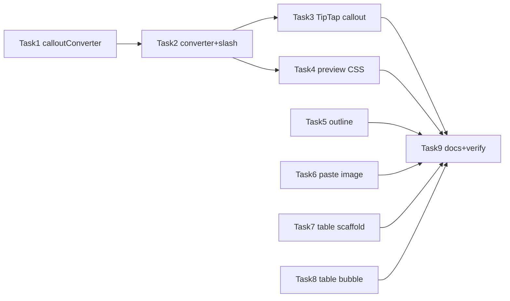

# Editor Outline, Callouts, Paste-Image & Table Editing Implementation Plan

> **For agentic workers:** REQUIRED SUB-SKILL: Use superpowers:subagent-driven-development (recommended) or superpowers:executing-plans to implement this plan task-by-task. Steps use checkbox (`- [ ]`) syntax for tracking.

**Goal:** Add document outline, Obsidian callouts, paste-to-project images, and Live table editing controls to the HydraNote markdown editor.

**Architecture:** Reuse `parseDocumentStructure` for outline; Obsidian `> [!type]` callouts with marked rewrite + TipTap node + turndown rule; shared paste-image helper wrapping `createFile`; TipTap Table bubble menu + Enter scaffolding in `useMarkdownShortcuts`.

**Tech Stack:** Vue 3, TipTap 3, marked, turndown, Vitest, existing `projectService.createFile`

**Spec:** [docs/superpowers/specs/2026-07-10-editor-outline-callouts-paste-table-design.md](../specs/2026-07-10-editor-outline-callouts-paste-table-design.md)

---

## File map

| File | Responsibility |
| --- | --- |
| `src/services/calloutConverter.ts` | Parse Obsidian callouts ↔ HTML (`data-callout`) for marked/Live |
| `src/extensions/calloutExtension.ts` | TipTap Callout node + optional Vue node view |
| `src/components/EditorOutline.vue` | Outline rail UI |
| `src/services/editorImagePaste.ts` | Save clipboard/base64 image via `createFile`, return markdown path |
| `src/components/MarkdownTableBubbleMenu.vue` | Live table controls |
| `src/composables/markdownSlashCommands.ts` | Add `/note` `/tip` `/warning` |
| `src/services/markdownConverter.ts` | Wire callout rewrite + turndown rule |
| `src/composables/useMarkdownShortcuts.ts` | Table header Enter scaffolding |
| `src/components/MarkdownEditor.vue` | Outline, paste, heading ids, callout CSS |
| `src/components/MarkdownLiveEditor.vue` | Callout ext, paste, table bubble menu |
| `src/views/WorkspacePage.vue` | Refactor `handleInsertImage` to shared helper |
| `docs/DEVELOPER.md` | Document features |
| `tests/unit/calloutConverter.spec.ts` | Callout round-trip |
| `tests/unit/editorImagePaste.spec.ts` | Paste helper |
| `tests/unit/tableScaffold.spec.ts` | Edit-mode table Enter |
| `tests/unit/markdownSlashCommands.spec.ts` | Extend for callout commands |

---

### Task 1: Callout converter (TDD)

**Files:**
- Create: `src/services/calloutConverter.ts`
- Test: `tests/unit/calloutConverter.spec.ts`

- [ ] **Step 1: Write failing tests** for:
  - `rewriteCalloutHtml(html)` or `markdownCalloutsToHtml(md)` turning `> [!note]\n> body` into a recognizable `data-callout="note"` block
  - `calloutHtmlToMarkdown` / turndown-compatible path restoring `> [!note]`
  - tip + warning variants; optional title on first line

- [ ] **Step 2: Run tests — expect fail**

```bash
npm run test:unit -- --run tests/unit/calloutConverter.spec.ts
```

- [ ] **Step 3: Implement `calloutConverter.ts`**
  - Export `CALLOUT_TYPES = ['note','tip','warning'] as const`
  - Export `rewriteCalloutsInMarkdownToHtml(md: string): string` **or** HTML post-process after `marked.parse` — pick one and keep Live + preview consistent
  - Export helper used by turndown rule: detect `div[data-callout]` / `aside.callout`

- [ ] **Step 4: Tests pass**

- [ ] **Step 5: Commit** (only if user requested commits; otherwise skip)

---

### Task 2: Wire callouts into markdownConverter + slash commands

**Files:**
- Modify: `src/services/markdownConverter.ts`
- Modify: `src/composables/markdownSlashCommands.ts`
- Modify: `tests/unit/markdownSlashCommands.spec.ts`

- [ ] **Step 1: Add turndown rule** in `markdownConverter.ts` for callout HTML → `> [!type]` markdown (mirror mermaid rule pattern ~lines 36–66)

- [ ] **Step 2: Apply callout rewrite** in `markdownToHtml` path used by Live (and document if preview uses a separate marked instance in `MarkdownEditor.vue` — wire both)

- [ ] **Step 3: Add slash commands** `note`, `tip`, `warning` with markdown templates `> [!note]\n> ` etc. TipTap action can temporarily insert markdown HTML until Task 3 lands; or stub `tiptapAction` to insertContent of rewritten HTML

- [ ] **Step 4: Extend slash command unit tests**

- [ ] **Step 5: Run** `npm run test:unit -- --run tests/unit/markdownSlashCommands.spec.ts tests/unit/calloutConverter.spec.ts`

---

### Task 3: TipTap Callout node + Live wiring

**Files:**
- Create: `src/extensions/calloutExtension.ts` (and optional `CalloutNodeView.vue`)
- Modify: `src/components/MarkdownLiveEditor.vue`
- Modify: `src/composables/markdownSlashCommands.ts` (`tiptapAction` → insert callout node)

- [ ] **Step 1: Create Callout node** following `MermaidBlock` pattern in `MarkdownLiveEditor.vue` (~184–210): attrs `type`, `title`; `parseHTML` on `[data-callout]`; `renderHTML` emits `data-callout`

- [ ] **Step 2: Register extension** in `buildEditor()` extensions array

- [ ] **Step 3: Ensure import path** runs callout rewrite before `setContent` (same place as `rewriteMermaidBlocks` / `rewriteTaskListHtml`)

- [ ] **Step 4: Point slash `tiptapAction`** at inserting the callout node

- [ ] **Step 5: Manual smoke** — `/note` in Live, switch to Edit, confirm `> [!note]` present

---

### Task 4: Callout styles in preview

**Files:**
- Modify: `src/components/MarkdownEditor.vue` (renderedContent pipeline + CSS)

- [ ] **Step 1: Ensure preview HTML** includes callout markup (reuse converter after `marked.parse`)

- [ ] **Step 2: Add CSS** for `.callout`, `.callout-note`, `.callout-tip`, `.callout-warning` (left border + icon/title; match existing teal/muted theme tokens `--hn-*`)

- [ ] **Step 3: Smoke** preview + split modes

---

### Task 5: Document outline component

**Files:**
- Create: `src/components/EditorOutline.vue`
- Modify: `src/components/MarkdownEditor.vue`
- Test (optional): `tests/unit/editorOutline.spec.ts` — pure function extracting outline items if extracted

- [ ] **Step 1: Implement `EditorOutline.vue`**
  - Props: `content: string`, `visible: boolean`
  - Emit: `navigate` with `{ level, title, startOffset, startLine }`
  - Use `parseDocumentStructure` and filter `type === 'heading'` (or map headings from that API)

- [ ] **Step 2: Layout** — wrap `.editor-content` children so outline is a left flex sibling (~240px); header toggle button (list icon)

- [ ] **Step 3: `navigate` handlers**
  - edit/split: set textarea selection to `startOffset`, focus, scroll
  - hybrid: `hybridEditorRef.getEditor()` find heading node, `commands.setTextSelection` + `scrollIntoView`
  - view: ensure headings have `id` (slugify title + index); `scrollIntoView` on preview pane

- [ ] **Step 4: Debounce outline recompute** on `content` (~200ms)

- [ ] **Step 5: Smoke** all four view modes

---

### Task 6: Paste-image helper (TDD)

**Files:**
- Create: `src/services/editorImagePaste.ts`
- Test: `tests/unit/editorImagePaste.spec.ts`
- Modify: `src/views/WorkspacePage.vue` (`handleInsertImage`)
- Modify: `src/components/MarkdownEditor.vue`
- Modify: `src/components/MarkdownLiveEditor.vue`

- [ ] **Step 1: Write failing tests** — given projectId + Uint8Array + mime, mocks `createFile`, returns `{ filePath, markdown }`

- [ ] **Step 2: Implement helper**
  ```ts
  export async function savePastedImage(opts: {
    projectId: string;
    binaryData: Uint8Array;
    mimeType: string;
    altText?: string;
  }): Promise<{ filePath: string; markdown: string }>
  ```
  Use `loadImageGenerationSettings().defaultImageDirectory`, timestamped filename `pasted-${Date.now()}.${ext}`

- [ ] **Step 3: Refactor `handleInsertImage`** to call helper for base64 path

- [ ] **Step 4: Edit/split `@paste`** — if `clipboardData.files` or items have `image/*`, `preventDefault`, require `projectId` prop/callback, save, `insertAtCursor`

- [ ] **Step 5: Live `editorProps.handlePaste`** — same logic; return `true` when handled

- [ ] **Step 6: Pass `projectId`** into `MarkdownLiveEditor` (already has prop) and ensure paste path uses it; toast via `toastController` when missing project

- [ ] **Step 7: Tests pass + manual paste smoke**

---

### Task 7: Table scaffolding in edit mode (TDD)

**Files:**
- Modify: `src/composables/useMarkdownShortcuts.ts` (`handleEnter`)
- Test: `tests/unit/tableScaffold.spec.ts` or extend `useMarkdownShortcuts.spec.ts`

- [ ] **Step 1: Write failing test** — value `| a | b |`, cursor at end, Enter → includes separator line and body row; cursor in body

- [ ] **Step 2: Implement** in `handleEnter` before generic return false:
  - Match line `/^\|(.+)\|$/`
  - Count columns; skip if next line already matches `/^\|?\s*:?-{3,}/`
  - Insert `\n| --- | --- |\n|  |  |` (dynamic columns)

- [ ] **Step 3: Tests pass** — ensure list/blockquote/fence tests still green

---

### Task 8: Live table bubble menu

**Files:**
- Create: `src/components/MarkdownTableBubbleMenu.vue` (or use `@tiptap/vue-3` BubbleMenu if already a dependency — check `package.json`; if not, floating `div` positioned from selection coords is fine)
- Modify: `src/components/MarkdownLiveEditor.vue`

- [ ] **Step 1: Detect selection inside table** via `editor.isActive('table')`

- [ ] **Step 2: Render controls** when active: Add row, Add column, Delete row, Delete column, Delete table — call TipTap chain commands

- [ ] **Step 3: Verify Tab** moves between cells; if not, add keymap extension

- [ ] **Step 4: Manual smoke** — `/table`, add row, add column, delete row

---

### Task 9: Docs + final verification

**Files:**
- Modify: `docs/DEVELOPER.md` (MarkdownEditor section after smart editing / slash / wikilink)

- [ ] **Step 1: Document** outline, callouts (Obsidian syntax), paste-image, table editing Live vs edit scaffolding

- [ ] **Step 2: Run full unit suite**

```bash
npm run test:unit -- --run
```

- [ ] **Step 3: Manual checklist**
  - [ ] Outline jump: edit / split / Live / preview
  - [ ] `/note` `/tip` `/warning` + Live↔Edit round-trip
  - [ ] Paste image with project selected
  - [ ] Paste image with no project → toast
  - [ ] Live table add/remove row/column
  - [ ] Edit mode `| a | b |` + Enter scaffolds

- [ ] **Step 4: Commit** only if user asks

---

## Execution order & dependencies



Tasks 5, 6, 7, 8 can run in parallel after Task 2 (or in parallel with 3–4 if ownership is split). Tasks 1→2→3 are sequential for callouts.

## Risk notes

- **Live round-trip:** Callouts must have an explicit turndown rule or they will flatten to plain blockquotes.
- **Outline jump in Live:** Match by offset in markdown string may drift after HTML round-trip; prefer matching heading text + level in the ProseMirror doc.
- **Paste size:** Reuse `createFile` image size limits (`MAX_IMAGE_DB_BYTES`); surface failure toast if create fails.
