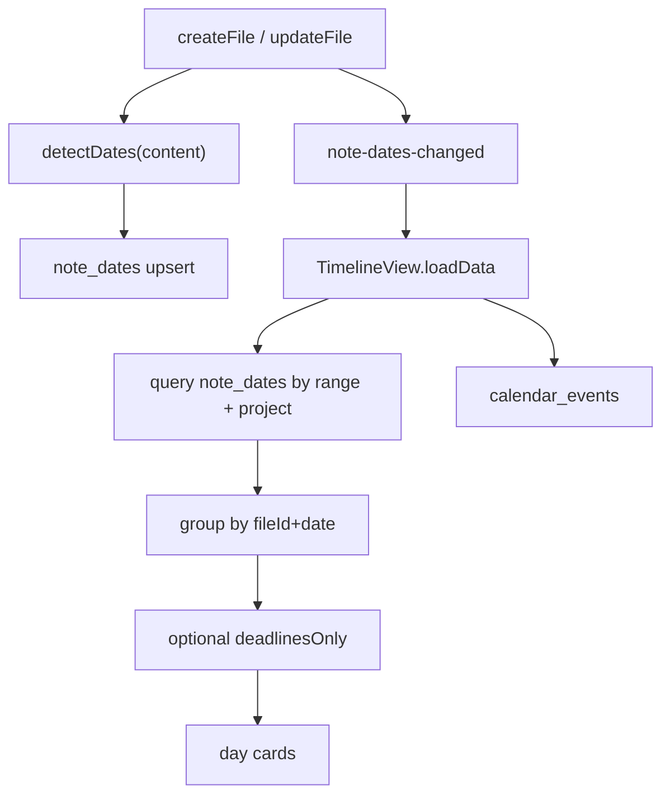

# Timeline Top-5 Improvements Implementation Plan

> **For agentic workers:** REQUIRED SUB-SKILL: Use superpowers:subagent-driven-development (recommended) or superpowers:executing-plans to implement this plan task-by-task. Steps use checkbox (`- [ ]`) syntax for tracking.

**Goal:** Make Timeline discoverable, scannable, and fast enough for daily use — without changing its core model (inline note dates + calendar events).

**Architecture:** Keep chrono-node detection as the source of truth. Persist detected dates into a DuckDB `note_dates` index on create/update (same lifecycle as search reindex). Timeline reads the index for the visible range instead of scanning every file. UI changes (empty state, deadlines filter, dedupe) live in `TimelineView.vue`. Live refresh listens for file-save index events and reloads the range slice.

**Tech Stack:** Vue 3 + Ionic, DuckDB WASM, chrono-node via existing `dateDetectionService.ts`.

**Locked top 5 (from smoke-test ranking):**
1. Teachable empty state
2. Deadlines-only filter
3. Deduplicate / group by file per day
4. Index dates at save time
5. Live refresh when notes change

**Non-goals for this slice:** frontmatter / `created_at` dating, clickable calendar events, jump-to-date, create-event from Timeline.

---

## File map

| File | Responsibility |
|------|----------------|
| `src/services/database.ts` | `note_dates` table + CRUD/query |
| `src/services/dateIndexService.ts` (new) | detect → upsert/delete; range query; change events |
| `src/services/projectService.ts` | call index on create/update/delete of md/txt |
| `src/components/TimelineView.vue` | empty state, deadlines filter, dedupe UI, read index, live reload |
| `src/composables/groupTimelineNoteRefs.ts` (new) | pure grouping helper (testable) |
| `tests/unit/dateIndexService.spec.ts` (new) | index upsert/query |
| `tests/unit/groupTimelineNoteRefs.spec.ts` (new) | grouping + deadline promotion |
| `docs/DEVELOPER.md` | document `note_dates` + Timeline behavior |



---

### Task 1: `note_dates` schema + CRUD

**Files:**
- Modify: `src/services/database.ts` (after `calendar_events` ~747–777)
- Test: `tests/unit/dateIndexService.spec.ts` (CRUD covered via service in Task 2)

- [ ] **Step 1: Add table + indexes in `initializeDatabase` / schema setup**

```sql
CREATE TABLE IF NOT EXISTS note_dates (
  id VARCHAR PRIMARY KEY,
  file_id VARCHAR NOT NULL,
  project_id VARCHAR NOT NULL,
  file_name VARCHAR NOT NULL,
  date_str VARCHAR NOT NULL,
  date_text VARCHAR NOT NULL,
  type VARCHAR NOT NULL,
  context_snippet VARCHAR,
  start_index INTEGER NOT NULL
);

CREATE INDEX IF NOT EXISTS idx_note_dates_range ON note_dates(date_str);
CREATE INDEX IF NOT EXISTS idx_note_dates_project ON note_dates(project_id);
CREATE INDEX IF NOT EXISTS idx_note_dates_file ON note_dates(file_id);
```

Denormalize `file_name` so Timeline does not need a join. Update it on rename.

- [ ] **Step 2: Add CRUD functions** (mirror calendar CRUD style ~1917–2048)

  - `replaceNoteDatesForFile(fileId, rows[])` — `DELETE FROM note_dates WHERE file_id = ?` then insert
  - `deleteNoteDatesForFile(fileId)`
  - `updateNoteDatesFileName(fileId, fileName)`
  - `getNoteDatesByRange(startStr, endStr, projectId?)` — `ORDER BY date_str ASC, file_name ASC`
  - `countNoteDates(): Promise<number>` — for lazy backfill gate

- [ ] **Step 3: Export from `src/services/index.ts` if that barrel re-exports DB helpers**

- [ ] **Step 4: Commit**

```
feat(timeline): add note_dates DuckDB table for indexed date refs
```

---

### Task 2: `dateIndexService` + save-path wiring

**Files:**
- Create: `src/services/dateIndexService.ts`
- Modify: `src/services/projectService.ts` (`createFile` ~675, `updateFile` ~865–872, delete path, `renameFile` ~887)
- Test: `tests/unit/dateIndexService.spec.ts`

- [ ] **Step 1: Write failing tests** for:
  - md content with "due July 12" → one deadline row
  - non-md/txt → no-op
  - replace clears previous rows for that file
  - range query filters by `date_str` and optional `projectId`

- [ ] **Step 2: Implement `dateIndexService.ts`**

```ts
// Core API shape
export async function reindexFileDates(
  fileId: string,
  projectId: string,
  fileName: string,
  content: string,
  fileType: string,
): Promise<void>

export async function clearFileDates(fileId: string): Promise<void>

export async function queryTimelineNoteDates(
  rangeStart: Date,
  rangeEnd: Date,
  projectId?: string,
): Promise<NoteDateRow[]>

export function onNoteDatesChanged(
  handler: (e: { fileId: string; projectId: string }) => void,
): () => void
```

Use a module-level `EventTarget` (or simple Set of listeners). Do **not** invent a global app store.

`reindexFileDates`:
1. If type not `md`/`txt`, `clearFileDates` and return
2. `detectDates(content)` from `dateDetectionService`
3. Map to rows (`date_str` via local YYYY-MM-DD, `type`, truncated context ≤100 chars, `start_index`)
4. `replaceNoteDatesForFile`
5. Emit `note-dates-changed`

- [ ] **Step 3: Wire `projectService`**
  - After md/txt create with content: `reindexFileDates`
  - After `updateFile` reindex block: `reindexFileDates` (same try/catch style as search reindex — warn, don't fail save)
  - On file delete: `clearFileDates`
  - On rename: `updateNoteDatesFileName`

- [ ] **Step 4: Run tests; commit**

```
feat(timeline): index note dates on file save
```

---

### Task 3: Lazy backfill on first Timeline open

**Files:**
- Modify: `src/services/dateIndexService.ts`
- Modify: `src/components/TimelineView.vue` `loadData()` (~269–328)

- [ ] **Step 1: Add `ensureNoteDatesBackfill(projectId?: string)`**
  - If `countNoteDates() > 0`, return immediately
  - Else load md/txt files (scoped like current Timeline: one project or all) and `reindexFileDates` each
  - Guard with an in-flight promise so concurrent Timeline opens don't double-backfill

- [ ] **Step 2: Call `ensureNoteDatesBackfill(props.projectId)` at start of `loadData()` before range query**
  - Keep spinner copy: "Scanning notes for dates..." during backfill only; afterward prefer "Loading timeline..."

- [ ] **Step 3: Manual check — empty index + existing notes → first open fills index; second open is fast**

- [ ] **Step 4: Commit**

```
feat(timeline): lazy-backfill note_dates on first open
```

---

### Task 4: Timeline reads index + live refresh

**Files:**
- Modify: `src/components/TimelineView.vue` (~269–341)

- [ ] **Step 1: Replace file-scan loop in `loadData()`** with `queryTimelineNoteDates(rangeStart, rangeEnd, props.projectId)`
  - Keep `getCalendarEventsByDateRange` unchanged
  - Map rows → existing `NoteReference` shape (`fileId`, `projectId`, `fileName`, `dateText`, `type`, `contextSnippet`)

- [ ] **Step 2: Subscribe on mount / unsubscribe on unmount**

```ts
onMounted(() => {
  loadData();
  unsubscribe = onNoteDatesChanged((e) => {
    if (props.projectId && e.projectId !== props.projectId) return;
    scheduleReload(); // 150ms debounce
  });
});
```

- [ ] **Step 3: Manual verification (smoke gap closed)**
  - Open Timeline → update a note with a new in-range date → card appears without close/reopen
  - Switch project scope → only that project's refs

- [ ] **Step 4: Commit**

```
feat(timeline): load from note_dates index and live-refresh on edits
```

---

### Task 5: Deduplicate / group by file per day

**Files:**
- Create: `src/composables/groupTimelineNoteRefs.ts`
- Create: `tests/unit/groupTimelineNoteRefs.spec.ts`
- Modify: `src/components/TimelineView.vue` (day note card render ~88–106, `allDays` / mapping)

- [ ] **Step 1: Write failing tests**

Rules (locked):
- Same `fileId` + same day → **one** grouped card
- `type = 'deadline'` if **any** mention that day is deadline
- `mentionCount` = detections for that file/day
- `contextSnippet` / `dateText` = first mention; when count > 1 UI shows count badge

- [ ] **Step 2: Implement `groupNoteRefsByFile(refs: NoteReference[]): GroupedNoteRef[]`**

- [ ] **Step 3: Apply grouping when building each day's `noteRefs`**
  - Card badge when `mentionCount > 1` (e.g. `3 mentions`)
  - Click still emits `open-file` with `fileId` / `projectId`

- [ ] **Step 4: Manual — three "July 12" mentions in one file → one card with badge**

- [ ] **Step 5: Commit**

```
feat(timeline): collapse same-day mentions into one card per file
```

---

### Task 6: Deadlines-only filter

**Files:**
- Modify: `src/components/TimelineView.vue` header controls (~10–15) + `visibleDays` (~230–233)

- [ ] **Step 1: Add `deadlinesOnly` ref + checkbox** next to "Show empty days"

- [ ] **Step 2: Filter logic (locked)**
  - When on: note cards must be `type === 'deadline'`
  - Calendar events **remain visible** (real schedule stays intact)
  - Empty-day hiding: after filter, hide days with no events and no remaining note refs, **except today** (same as current `visibleDays` rule)

- [ ] **Step 3: Manual — toggle on shows only amber deadline cards (e.g. Jul 12/17/20 from smoke content)**

- [ ] **Step 4: Commit**

```
feat(timeline): add deadlines-only filter toggle
```

---

### Task 7: Teachable empty state

**Files:**
- Modify: `src/components/TimelineView.vue` empty block (~115–119) + styles

- [ ] **Step 1: Detect true empty** — no calendar events and no note refs in range (only today empty row or zero days with content)

- [ ] **Step 2: Replace sparse copy with teachable empty state**
  - Title: **No dates in this range**
  - Body: Mention dates in notes and they'll show up here.
  - Examples (static chips/text): `due next Friday` · `meeting on July 15` · `deadline tomorrow`
  - Secondary: Expand the date range or switch projects
  - No modal / tour

- [ ] **Step 3: Manual — empty project shows teaching; project with dates does not**

- [ ] **Step 4: Commit**

```
feat(timeline): teach empty state how to surface dates from notes
```

---

### Task 8: Docs + verification

**Files:**
- Modify: `docs/DEVELOPER.md` (Smart Date Detection / Timeline ~1475–1563)

- [ ] **Step 1: Document `note_dates`, save-time indexing, backfill, live refresh, dedupe, deadlines filter**

- [ ] **Step 2: Run `npm run test:unit -- --run` for new specs + related**

- [ ] **Step 3: Manual checklist**
  1. Empty project → teachable empty state
  2. Seed dates → chronological cards
  3. Multi-mention → one card + count
  4. Deadlines only → amber only (+ calendar if any)
  5. Edit while open → live update
  6. Out-of-range still requires range expand
  7. Project scope respected

- [ ] **Step 4: Redteam pass on index consistency (delete/rename) and double-loadData watches**

- [ ] **Step 5: Final commit if docs-only delta remains**

```
docs(timeline): document note_dates index and Timeline UX upgrades
```

---

## Phase order

```
Task 1 (schema) → Task 2 (index service) → Task 3 (backfill) → Task 4 (read + live)
  → Task 5 (dedupe) → Task 6 (deadlines filter) → Task 7 (empty state) → Task 8 (docs/verify)
```

Tasks 5–7 can partially parallelize after Task 4, but dedupe should land before deadlines filter so filtering operates on grouped cards.

## Expected outcome

- Timeline opens from `note_dates` (fast after backfill)
- Editing a note updates Timeline while it stays open
- Same-day multi-mentions collapse to one card with a count badge
- Deadlines-only toggle isolates actionable note dates (calendar events still show)
- Empty users understand they must write dates in notes
- Unit tests cover index + grouping; DEVELOPER.md updated
