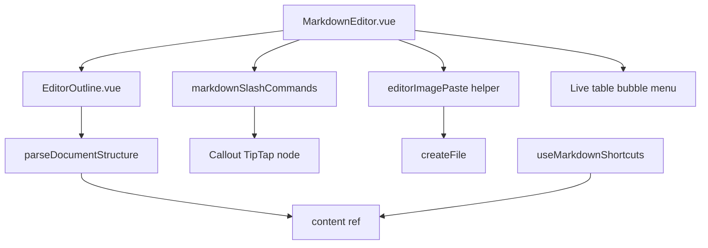

# Editor Outline, Callouts, Paste-Image & Table Editing Design

**Date:** 2026-07-10  
**Status:** Approved for implementation planning  
**Scope:** Markdown editor only (edit / split / Live / preview). Not DOCX / PDF / ImageViewer.

## Goal

Make HydraNote’s markdown editor feel first-class for long-form note editing by adding:

1. A **document outline** (click-to-jump headings)
2. **Obsidian-style callouts** (`> [!note]`, `> [!tip]`, `> [!warning]`) with slash commands
3. **Paste image** into the current project as a file + markdown image link
4. **Table editing** — usable Live-mode controls plus light edit-mode scaffolding

## Non-goals

- Heading fold / section collapse
- Math (`$…$`), footnotes, AI ghost-text
- GitHub callout aliases (`[!NOTE]` uppercase-only variants as a separate syntax — Obsidian form is canonical)
- Drag-reorder table rows, merge cells, CSV import
- Outline search / filter UI
- Rewriting the Live HTML round-trip architecture beyond what callouts require

## Decisions

| Topic | Choice |
| --- | --- |
| Callout syntax | Obsidian: `> [!note]`, `> [!tip]`, `> [!warning]` (optional title after type) |
| Callout Live support | Custom TipTap node + turndown rule (same pattern as MermaidBlock) |
| Outline source | Parse `content` via existing `parseDocumentStructure` (works all modes) |
| Outline placement | Collapsible left rail inside `.editor-content` in `MarkdownEditor.vue` |
| Paste image | Shared helper extracted from `WorkspacePage.handleInsertImage`; wire paste in edit/split + Live |
| Paste requires | Open project (`currentFile.projectId` or `currentProject.id`); toast if missing |
| Table Live | Floating / bubble controls: add/remove row/column, delete table; Tab between cells |
| Table edit/split | Header row `| a | b |` + Enter → separator + empty body row |
| Architecture | Approach A — reuse existing pipelines; no editor rewrite |

## Feature 1 — Document outline

### Behavior

- Show a narrow left rail listing H1–H6 from the current note, indented by level.
- Click a heading → jump to that location in the active view mode.
- Empty state: “No headings” (or hide rail content) when none exist.
- Toggle button in the editor header to show/hide the outline (persist preference in `localStorage` optional; default **visible** when ≥1 heading).

### Implementation notes

| Piece | Location |
| --- | --- |
| Parse | Reuse `parseDocumentStructure` / heading entries from `src/services/documentProcessor.ts` (~466–553) |
| UI | New `EditorOutline.vue` (or inline in `MarkdownEditor.vue`) as sibling inside `.editor-content` |
| Jump — edit/split | Set textarea `selectionStart` to heading `startOffset`, `scrollIntoView` / set `scrollTop` from line |
| Jump — Live | Walk Tiptap doc for matching heading text/level; `setTextSelection` + `scrollIntoView` |
| Jump — preview | Add stable `id` attributes to headings in marked output (slug from title); `querySelector` + `scrollIntoView` |

### Acceptance

- Outline updates as the user types (debounced ~150–300ms is fine).
- Click jumps correctly in edit, split, Live, and preview.
- No crash on empty / heading-less notes.

## Feature 2 — Obsidian callouts

### Syntax

```markdown
> [!note]
> Body text

> [!tip] Optional title
> Tip body

> [!warning]
> Warning body
```

Supported types for v1: **`note`**, **`tip`**, **`warning`** (case-insensitive parse; emit lowercase).

### Slash commands

Add to `SLASH_COMMANDS` in `src/composables/markdownSlashCommands.ts`:

| id | markdown insert (edit/split) | Live |
| --- | --- | --- |
| `note` | `> [!note]\n> ` | Insert Callout node `type=note` |
| `tip` | `> [!tip]\n> ` | Insert Callout node `type=tip` |
| `warning` | `> [!warning]\n> ` | Insert Callout node `type=warning` |

### Rendering

- **Preview / split-right / view:** Preprocess or marked extension converts callout blockquotes into `<aside class="callout callout-note">` (etc.) with title + body. Style in `MarkdownEditor.vue` CSS.
- **Live:** TipTap `Callout` node (attrs: `type`, optional `title`) with Vue node view or styled `div[data-callout]`. Parse from HTML produced by `markdownToHtml` after a callout rewrite step (mirror `rewriteMermaidBlocks` / `rewriteTaskListHtml`).
- **Round-trip:** Turndown rule: `div[data-callout]` / callout node → `> [!type]` markdown. Must survive Live → Edit without losing type.

### Acceptance

- `/note`, `/tip`, `/warning` insert in edit and Live.
- Preview and Live show distinct styled callouts.
- Live ↔ Edit preserves `> [!note]` (and tip/warning).
- Unit tests for parse → HTML → markdown round-trip of the three types.

## Feature 3 — Paste image

### Behavior

1. User pastes while focused in the markdown editor (edit, split, or Live).
2. If clipboard contains an image file/blob, prevent default text paste for that path.
3. Save via `createFile(projectId, \`${dir}/pasted-${timestamp}.${ext}\`, …, binaryData)` using `loadImageGenerationSettings().defaultImageDirectory` (default `images`).
4. Insert `` at cursor (`insertAtCursor`).
5. If no project context: toast “Open or select a project to paste images” and do not insert a data URL by default (avoids bloating notes).

### Implementation notes

| Piece | Location |
| --- | --- |
| Extract shared save+path logic | New helper e.g. `src/services/editorImagePaste.ts` or composable used by WorkspacePage + editors |
| Refactor | `WorkspacePage.handleInsertImage` should call the same helper for the base64 → file path path |
| Edit/split | `@paste` on textareas in `MarkdownEditor.vue` |
| Live | `editorProps.handlePaste` in `MarkdownLiveEditor.vue` (or small TipTap extension) |
| Project id | Prop/callback from parent: `currentProject?.id \|\| currentFile?.projectId` |

### Acceptance

- Paste PNG/JPEG/WebP creates a project file and inserts a relative markdown image.
- Chat “insert image” still works (shared helper).
- Paste without project shows toast; note content unchanged.
- Non-image paste (text) unchanged.

## Feature 4 — Table editing

### Live mode

Tiptap `Table` is already configured (`resizable: true`) in `MarkdownLiveEditor.vue`.

Add:

- **Tab / Shift+Tab** — move to next/previous cell (TipTap Table usually provides this; verify and enable if missing).
- **Bubble / floating menu** when selection is inside a table:
  - Add row above/below
  - Add column left/right
  - Delete row / column
  - Delete table
- Use TipTap commands: `addRowBefore`, `addRowAfter`, `addColumnBefore`, `addColumnAfter`, `deleteRow`, `deleteColumn`, `deleteTable`.

### Edit / split scaffolding

In `useMarkdownShortcuts` (or a small dedicated helper):

- When current line matches a markdown table header row (e.g. `| … | … |`) and the next line is **not** already a separator, **Enter** inserts:
  ```
  | --- | --- |
  |  |  |
  ```
  (column count derived from header cells) and places the cursor in the first body cell.

### Acceptance

- `/table` still inserts a 3-column table.
- In Live, user can add/remove rows and columns via UI without leaving the keyboard for Tab navigation.
- In edit mode, header + Enter scaffolds separator + body row.
- Unit test for edit-mode scaffolding; Live controls covered by manual smoke checklist.

## Architecture diagram



## Testing

| Area | Tests |
| --- | --- |
| Callouts | Unit: parse Obsidian syntax → HTML attrs; turndown round-trip |
| Slash | Extend `markdownSlashCommands.spec.ts` for note/tip/warning |
| Table scaffold | Unit: Enter after header row inserts separator + body |
| Outline | Unit: heading list from fixture markdown; optional component smoke |
| Paste | Unit: helper builds path + calls createFile with binary (mocked) |

Manual smoke: outline jump all modes; paste image; Live table add row; callout Live↔Edit.

## Docs

Update `docs/DEVELOPER.md` MarkdownEditor section: outline, callouts, paste-image, table editing.

## Expected outcome

Users can navigate long notes via outline, insert styled Obsidian callouts from `/`, paste screenshots into the project as files, and edit tables in Live without hand-writing pipe syntax—while edit mode remains a capable raw-markdown path.
